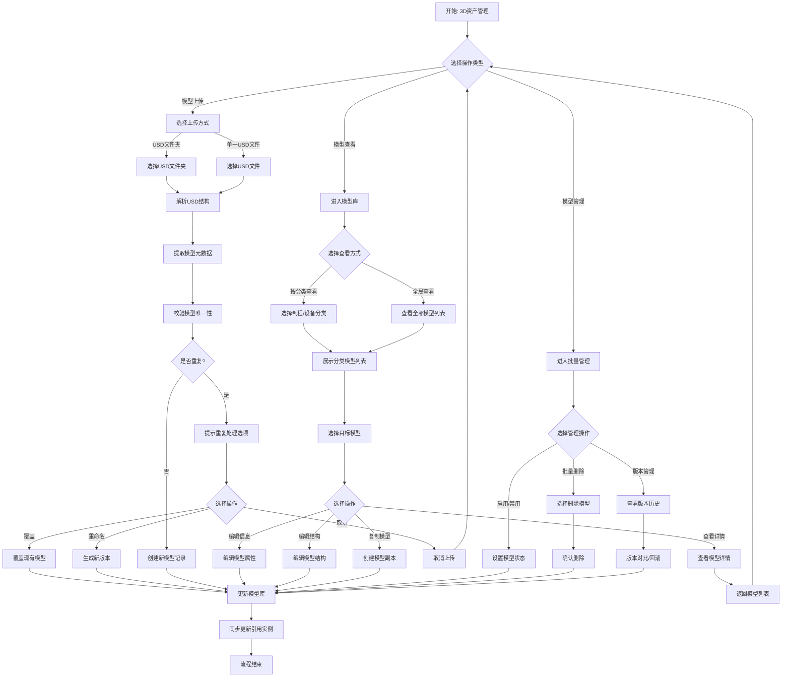
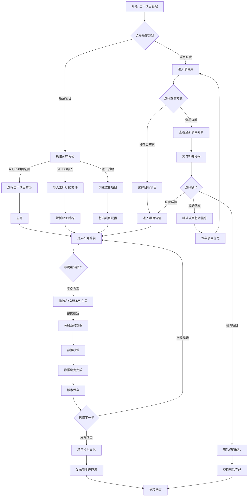
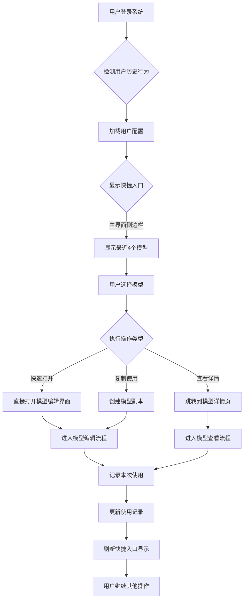

# AI Factory Creator - 核心业务流程详解

> **文档类型**: 业务流程规范  
> **最后更新**: 2026-04-01  
> **版本**: v2.0  
> **适用范围**: AI Factory Creator工具开发团队、产品团队、业务用户（IE工程师、工厂规划师）

---

## 一、3D资产模型管理模块

### 1.1 模块背景与业务价值

#### 业务背景
AI Factory Creator的核心基础是**3D资产模型库**，这是工厂数字孪生的基石。在传统工厂布局设计中，工程师需要手动收集、整理和管理大量的设备3D模型，存在以下痛点：
- **模型分散**: 设备模型分散在不同部门、不同工程师手中，缺乏统一管理
- **格式混乱**: 模型格式多样（STEP、FBX、OBJ等），兼容性问题严重
- **版本混乱**: 同一设备有多个版本模型，无法确定哪个是最新版本
- **重用困难**: 已有模型无法快速查找和复用，每次设计都从零开始

#### 模块价值
3D资产模型管理模块通过建立**集中化、标准化、可追溯**的模型库，实现：
- **统一存储**: 所有设备、产线模型集中管理，支持USD标准格式
- **智能检索**: 支持按分类、属性、关键词等多维度快速查找
- **版本控制**: 完整的模型版本历史，支持回滚和比较
- **权限管理**: 不同角色对模型的不同操作权限控制
- **关联追溯**: 模型与工厂项目、实例的关联关系清晰可查

#### 目标用户
- **U3D工程师**: 负责模型创建、上传、编辑、技术维护
- **IE工程师**: 负责模型查找、使用、业务属性配置
- **工厂规划师**: 负责模型选择、布局应用、效果验证

#### 核心功能范围
1. **模型查看与检索**: 分类浏览、全局搜索、快速查找
2. **模型上传与导入**: 支持USD格式及主流3D格式导入
3. **模型编辑与更新**: 模型结构、属性、元数据编辑
4. **模型版本管理**: 版本创建、历史追溯、差异比较
5. **模型生命周期管理**: 启用/禁用、删除、归档管理
6. **模型关联管理**: 与工厂项目、业务数据的关联关系

### 1.2 详细流程

**流程说明**:
1. **模型查看流程**: 用户进入模型库，可按分类或全局查看模型列表，选择模型后进行查看、编辑等操作
2. **模型上传流程**: 支持USD文件夹或单个文件上传，系统自动解析结构、提取元数据、校验唯一性，处理重复情况
3. **模型管理流程**: 批量操作包括启用/禁用、删除、版本管理等，所有操作最终更新模型库并同步影响引用实例
4. **闭环设计**: 所有操作结束后返回主入口，支持连续操作，模型更新自动同步到引用实例

### 1.3 关键节点说明

| 节点 | 节点名称 | 操作角色 | 输入数据 | 处理逻辑 | 校验规则 | 输出结果 | 异常处理 |
|------|----------|----------|----------|----------|----------|----------|----------|
| **N1** | **模型查看与检索** | IE工程师/工厂规划师 | 搜索关键词、分类筛选条件 | 1. 用户输入搜索条件 2. 系统检索模型库 3. 返回匹配结果列表 4. 用户选择模型查看详情 | 1. 搜索关键词长度≥2字符 2. 分类筛选条件必须在预定义范围内 | 1. 模型列表（含缩略图、名称、分类） 2. 模型详情（属性、版本、关联关系） | 1. 无搜索结果时显示友好提示 2. 搜索超时提示重试 3. 网络异常提示检查连接 |
| **N2** | **USD模型上传** | U3D工程师 | 1. USD文件/文件夹 2. 模型分类（工厂/产线/设备） 3. 模型属性（名称、描述、标签） | 1. 选择上传文件 2. 系统解析USD结构 3. 提取模型元数据 4. 校验模型唯一性 5. 保存到模型库 | 1. 文件格式必须为USD或支持的3D格式 2. 模型名称在分类内必须唯一 3. 文件大小≤500MB 4. 模型结构完整（包含几何、材质、层级） | 1. 上传成功：生成模型ID，创建版本记录 2. 重复处理：提供覆盖、重命名、取消选项 | 1. 格式不支持提示转换选项 2. 文件损坏提示重新上传 3. 权限不足提示申请权限 |
| **N3** | **模型编辑与更新** | U3D工程师/IE工程师 | 1. 目标模型ID 2. 更新内容（属性/结构） 3. 更新备注 | 1. 进入模型编辑界面 2. 修改模型属性或结构 3. 保存更改 4. 系统提示影响范围 5. 用户确认后执行更新 | 1. 必须有关联工厂项目时提示影响确认 2. 关键属性（如分类、尺寸）变更需要审批 3. 结构变更需保持拓扑完整性 | 1. 模型更新成功，版本号递增 2. 关联实例同步更新 3. 生成更新记录 | 1. 更新冲突提示合并或覆盖 2. 引用检查失败提示解除关联后操作 3. 保存失败提示重试或另存为新版本 |
| **N4** | **模型启用/禁用** | U3D工程师 | 1. 目标模型ID 2. 目标状态（启用/禁用） | 1. 选择模型设置状态 2. 系统检查引用关系 3. 执行状态变更 4. 更新模型可用性 | 1. 禁用前检查是否被工厂项目引用 2. 启用前检查模型完整性 3. 状态变更需要操作权限 | 1. 状态变更成功提示 2. 被引用时提示无法禁用详情 | 1. 引用关系异常提示强制解除或保留 2. 权限不足提示申请权限 |
| **N5** | **模型删除** | U3D工程师 | 1. 目标模型ID列表 2. 删除确认 | 1. 选择待删除模型（必须已禁用） 2. 系统二次确认 3. 执行删除 4. 清理关联关系 | 1. 模型必须处于禁用状态 2. 无任何工厂项目引用 3. 删除需要管理员权限 | 1. 删除成功提示 2. 释放存储空间统计 | 1. 引用关系残留提示手动清理 2. 删除失败提示重试或联系管理员 |
| **N6** | **模型版本管理** | U3D工程师 | 1. 目标模型ID 2. 版本操作（查看/回滚/比较） | 1. 查看版本历史 2. 选择版本进行比较 3. 选择历史版本回滚 4. 创建新版本分支 | 1. 回滚操作创建新版本而非覆盖 2. 版本比较需相同模型ID 3. 分支创建需提供分支名称 | 1. 版本历史列表 2. 版本差异可视化对比 3. 回滚成功新版本创建 | 1. 版本数据损坏提示从备份恢复 2. 回滚冲突提示解决策略 |
| **N7** | **模型复制与派生** | U3D工程师/IE工程师 | 1. 源模型ID 2. 派生配置（名称、属性继承） | 1. 选择源模型复制 2. 生成派生模型副本 3. 编辑派生模型 4. 保存为新模型 | 1. 派生模型必须修改名称或关键属性 2. 继承关系需要明确记录 3. 派生模型独立版本管理 | 1. 新模型创建成功 2. 自动建立与源模型的派生关系 3. 新模型默认启用状态 | 1. 源模型删除时派生关系处理 2. 属性继承冲突提示手动解决 |

**关键节点关联关系**:
1. **N2→N3→N6**: 模型上传后可以编辑更新，更新产生新版本记录
2. **N4→N5**: 模型必须先禁用才能删除，状态管理是删除的前提
3. **N3→N7**: 模型编辑可基于复制派生，支持变体设计
4. **N1贯穿全程**: 模型查看检索是所有操作的前置条件

---

## 二、工厂项目管理模块

### 2.1 模块背景与业务价值

#### 业务背景
工厂布局设计是制造业的核心环节，传统方式存在以下痛点：
- **设计效率低**: 手工绘制布局图，每次产品变更需重新设计，耗时2-3天
- **决策缺乏数据支持**: 依赖经验和Excel表格，缺乏实时业务数据关联
- **验证成本高**: 物理调整后才能发现布局问题，造成设备搬迁浪费
- **协作困难**: 多部门协作缺乏统一平台，版本混乱，沟通成本高

#### 模块价值
工厂项目管理模块通过**数字孪生**技术，实现工厂布局的虚拟设计与验证：
- **可视化设计**: 基于3D模型的拖拽式布局编辑，所见即所得
- **数据驱动**: 与ERP/MES/WMS业务数据实时绑定，支持数据驱动决策
- **虚拟验证**: 在数字环境中验证布局合理性，避免物理调整错误
- **协作管理**: 多角色协同编辑，版本控制，变更追踪
- **知识沉淀**: 布局模板库，最佳实践积累和复用

#### 目标用户
- **IE工程师**: 负责工厂布局设计、产线平衡分析、效率优化
- **工厂规划师**: 负责整体工厂规划、功能区划分、物流优化
- **U3D工程师**: 负责3D技术支撑、模型适配、渲染优化
- **生产管理者**: 负责布局审批、决策支持、效果评估

#### 核心功能范围
1. **项目创建与初始化**: 新建工厂项目，导入基础布局模板
2. **布局可视化编辑**: 拖拽式设备布置，产线配置，区域划分
3. **数据绑定与集成**: 关联业务系统数据，实现数字孪生
4. **版本与协作管理**: 项目版本控制，多用户协作编辑
5. **发布与部署**: 布局方案发布，导出到生产系统

### 2.2 详细流程

**流程说明**:
1. **项目查看与选择**: 用户可查看已有项目列表或直接进入特定项目，支持全局搜索和分类筛选
2. **项目创建**: 支持三种创建方式 - 模板创建（快速启动）、USD导入（已有布局）、空白创建（完全自定义）
3. **布局编辑**: 核心设计环节，包括设备布置、产线配置、区域划分、数据绑定等操作
4. **数据集成**: 与设备管理/IOT等系统通过基础数据平台进行数据绑定，实现数字孪生
5. **发布部署**: 完成设计后通过审批流程发布到生产环境
6. **闭环管理**: 支持版本控制、协作编辑、变更追踪的全生命周期管理

### 2.3 关键节点说明

| 节点 | 节点名称 | 操作角色 | 输入数据 | 处理逻辑 | 校验规则 | 输出结果 | 异常处理 |
|------|----------|----------|----------|----------|----------|----------|----------|
| **P1** | **项目创建与初始化** | IE工程师/工厂规划师 | 1. 项目名称/描述 2. 创建方式（模板/USD/空白） 3. 基础配置参数 | 1. 选择创建方式 2. 配置项目基本信息 3. 初始化项目结构 4. 生成项目唯一ID | 1. 项目名称在组织内唯一 2. USD文件格式验证 3. 模板兼容性检查 4. 权限验证 | 1. 项目创建成功 2. 初始布局环境 3. 默认权限设置 | 1. 名称重复提示修改 2. 文件格式错误提示转换 3. 权限不足提示申请 |
| **P2** | **布局可视化编辑** | IE工程师 | 1. 3D设备模型 2. 布局参数（位置/朝向/缩放） 3. 产线配置（节拍/工序） | 1. 拖拽设备到布局区域 2. 调整设备位置和方向 3. 配置产线工艺流程 4. 设置功能区划分 | 1. 设备碰撞检测 2. 产线节拍合理性 3. 物流路径通畅性 4. 安全间距合规性 | 1. 3D布局可视化 2. 布局参数保存 3. 产线配置完成 | 1. 设备冲突提示调整 2. 节拍不合理警告 3. 保存失败提示重试 |
| **P3** | **业务数据绑定** | IE工程师/系统集成工程师 | 1. 业务系统接口配置 2. 数据映射规则 3. 实时数据订阅 | 1. 配置ERP/MES/WMS连接 2. 定义数据字段映射 3. 建立实时数据通道 4. 验证数据一致性 | 1. 接口连通性测试 2. 数据格式验证 3. 映射完整性检查 4. 实时性要求验证 | 1. 数据绑定成功 2. 实时数据流建立 3. 数据一致性报告 | 1. 接口连接失败提示检查 2. 数据格式不匹配提示转换 3. 映射缺失提示补充 |
| **P5** | **项目版本管理** | 所有项目成员 | 1. 版本备注 2. 变更内容描述 3. 影响范围评估 | 1. 创建新版本快照 2. 记录变更内容 3. 更新版本历史 4. 管理版本分支 | 1. 版本备注必填 2. 重大变更需审批 3. 版本编号规则 | 1. 新版本创建成功 2. 版本差异报告 3. 历史版本列表 | 1. 版本冲突提示合并 2. 审批流程异常提示 3. 存储空间不足提示清理 |
| **P6** | **协作编辑管理** | 多角色协同 | 1. 用户权限配置 2. 协作会话管理 3. 变更冲突检测 | 1. 设置用户操作权限 2. 管理实时协作会话 3. 检测和解决编辑冲突 4. 记录协作历史 | 1. 权限层级合理性 2. 冲突解决机制 3. 会话超时处理 | 1. 协作环境就绪 2. 实时同步状态 3. 冲突解决记录 | 1. 权限冲突提示调整 2. 网络断开提示重连 3. 冲突无法自动解决提示人工干预 |
| **P7** | **项目发布与部署** | IE工程师/生产管理者 | 1. 发布审批流程 2. 部署配置参数 3. 回滚方案 | 1. 发起发布申请 2. 审批流程执行 3. 部署到生产环境 4. 验证部署效果 | 1. 布局设计完整性 2. 数据绑定完整性 3. 审批流程完整性 4. 生产环境兼容性 | 1. 发布成功通知 2. 部署完成确认 3. 生产环境访问链接 | 1. 审批被驳回提示修改 2. 部署失败提示回滚 3. 环境不兼容提示调整 |

**关键节点关联关系**:
1. **P1→P2→P3**: 项目创建后进入布局编辑，完成后进行数据绑定
2. **P5贯穿全程**: 版本管理覆盖所有操作环节
3. **P6支持协同**: 协作编辑支持多角色并行工作
4. **P3→P7**: 数据绑定完整是项目发布的前提条件

---

## 三、3D资产快捷入口

### 3.1 模块背景与业务价值

#### 业务背景
在工厂布局设计工作中，工程师经常需要反复操作同一组3D资产模型。传统方式需要：
- **多次导航**: 每次都需要从模型库中重新查找和选择
- **记忆负担**: 需要记住模型名称或分类路径
- **操作繁琐**: 重复的搜索和选择操作影响设计效率

#### 模块价值
3D资产快捷入口通过**智能记忆和快速访问**机制，提供：
- **快速访问**: 一键访问最近使用的3D资产，减少导航步骤
- **个性化推荐**: 基于用户行为推荐相关模型，提高发现效率
- **工作流优化**: 支持连续设计任务，减少上下文切换
- **智能排序**: 根据使用频率、最近时间、项目关联度智能排序

#### 目标用户
- **IE工程师**: 频繁使用特定设备模型进行布局设计
- **工厂规划师**: 需要快速访问常用产线模板和设备组合
- **U3D工程师**: 需要快速编辑和更新正在处理的模型

#### 核心功能范围
1. **最近使用记录**: 自动记录用户最近访问的3D资产模型
2. **快速操作**: 一键打开、编辑、复制常用模型

### 3.2 详细流程

**流程说明**:
1. **智能初始化**: 用户登录后，系统根据历史行为加载配置用户近期使用的四个模型
2. **快速操作**: 支持直接打开、查看详情、复制使用等多种快捷操作

### 3.3 关键节点说明

| 节点 | 节点名称 | 操作角色 | 输入数据 | 处理逻辑 | 校验规则 | 输出结果 | 异常处理 |
|------|----------|----------|----------|----------|----------|----------|----------|
| **Q1** | **快捷入口展示** | 系统自动 | 1. 推荐模型列表 2. 用户界面配置 3. 显示位置参数 | 1. 按权重排序模型 2. 生成可视化卡片 3. 渲染到指定位置 4. 添加交互事件 | 1. 显示数量限制 2. 加载性能优化 3. 响应式适配 | 1. 快捷入口界面 2. 模型缩略图预览 3. 操作按钮组 | 1. 模型加载失败显示占位符 2. 界面渲染失败降级显示 3. 性能超时提示简化显示 |
| **Q2** | **快速模型操作** | 用户触发 | 1. 目标模型ID 2. 操作类型（打开/查看/复制） 3. 目标项目上下文 | 1. 解析操作意图 2. 执行对应操作逻辑 3. 跳转到相应界面 4. 传递上下文参数 | 1. 模型可用性验证 2. 操作权限验证 3. 目标项目兼容性 | 1. 快速进入对应功能 2. 携带预填充参数 3. 操作成功反馈 | 1. 模型不可用提示替代方案 2. 权限不足提示申请 3. 操作失败提供重试选项 |

**关键节点关联关系**:
1. **Q1→Q2**: 展示快捷入口，用户执行操作
2. **Q1实时更新**: 根据用户操作实时刷新快捷入口内容

---

## 四、流程设计原则

### 4.1 反向闭环原则
- **可反向生成3D资产模型**：若在工厂项目中上传工厂USD文件，可校验实例是否有对应模型，若没有则需要填充相应模型，即资产实例USD文档反向存储至3D资产库中，并做好模型与实例的引用关系绑定
- **模型的新版本创建**：版本变更判断原则：名称一致但最后一位index变更
- **双向同步机制**：
  1. **正向流程**：3D资产库 → 工厂项目（模型实例化）
  2. **反向流程**：工厂项目 → 3D资产库（实例模型化）
  3. **同步触发条件**：USD文件导入、模型结构变更、实例独立修改
- **引用关系管理**：
  1. **一对一引用**：单个模型可被多个项目实例引用
  2. **引用完整性**：模型删除前必须解除所有实例引用
  3. **引用追溯**：支持从模型查看所有引用实例，从实例追溯源模型
- **版本一致性保证**：
  1. **模型版本锁定**：项目创建时锁定模型版本，避免意外变更影响设计
  2. **版本升级控制**：支持手动升级项目引用的模型版本，需验证兼容性
  3. **多版本共存**：同一模型的不同版本可被不同项目同时引用

### 4.2 资产实例属性继承原则
- **模型属性为源，实例属性为流**：3D资产模型定义基础属性（几何结构、材质、分类、技术参数），工厂项目中的实例继承这些基础属性，并可扩展项目特定属性（布局位置、产线关联、业务数据绑定）
- **属性层级继承**：
  1. **基础属性继承**：实例自动继承模型的几何、材质、分类等核心属性
  2. **默认值覆盖**：实例可覆盖模型的默认属性值（如颜色、显示状态）
  3. **扩展属性添加**：实例可添加项目特有的属性（如设备编号、维护计划、生产指标）
- **继承关系维护**：
  1. **模型变更同步**：当模型基础属性变更时，系统提示实例影响范围，用户选择是否同步更新
  2. **实例独立修改**：实例特有属性修改不影响源模型，支持个性化配置
  3. **版本关联追溯**：模型版本与实例版本建立关联关系，确保设计一致性
- **冲突解决机制**：
  1. **属性冲突检测**：当模型与实例属性定义冲突时，系统自动检测并提示
  2. **继承优先级**：实例属性 > 模型默认属性 > 模型基础属性
  3. **批量冲突解决**：支持批量处理同一模型多个实例的属性冲突

### 4.3 状态流转原则
- **状态定义标准化**：
  1. **草稿状态**：初始创建或编辑中，未提交审批
  2. **审核状态**：已提交审批，等待审批决策
  3. **执行状态**：审批通过，正在实施或使用中
  4. **完成状态**：正常结束，达成预期目标
  5. **异常状态**：驳回、取消、关闭、挂起等异常终止
- **正向流转**：草稿→审核→执行→完成（标准工作流）
- **逆向流转**：驳回/取消/关闭/挂起（异常处理流）
- **状态流转控制**：
  1. **条件触发**：状态变更必须满足前置条件（如草稿→审核需完成必填项）
  2. **权限控制**：不同状态变更需要相应操作权限（如审核→执行需审批人权限）
  3. **记录审计**：所有状态变更记录操作人、时间、原因
- **状态闭环设计**：
  1. **任何状态都有出口**：不允许陷入死循环状态
  2. **超时自动处理**：长时间未处理状态自动流转（如审核超时自动驳回）
  3. **状态恢复机制**：支持从异常状态恢复至最近有效状态
- **多实体状态协同**：
  1. **父子状态同步**：项目状态影响子模型、实例状态
  2. **关联状态约束**：关联实体状态相互约束（如模型禁用时实例不可用）
  3. **批量状态管理**：支持批量变更相关实体状态

### 4.4 异常处理原则
- **分层防御策略**：
  1. **前端预防层**：输入校验、业务规则校验、实时反馈
  2. **业务逻辑层**：事务控制、数据一致性校验、并发控制
  3. **系统集成层**：接口健壮性、超时处理、重试机制
  4. **基础设施层**：监控告警、自动恢复、灾备方案
- **异常分类处理**：
  1. **可预期异常**：业务规则违规、数据校验失败等，提供友好提示和纠正指导
  2. **系统异常**：网络超时、服务不可用等，提供重试机制和降级方案
  3. **数据异常**：数据不一致、引用丢失等，提供数据修复工具和恢复流程
  4. **安全异常**：权限不足、数据泄露风险等，立即阻断并记录审计日志
- **异常留痕与追溯**：
  1. **完整异常记录**：异常类型、发生时间、上下文数据、堆栈信息
  2. **影响范围评估**：评估异常对业务数据、用户体验、系统稳定的影响
  3. **根因分析支持**：提供异常分析工具，支持问题定位和根本解决
- **异常恢复机制**：
  1. **自动恢复**：支持重试、回滚、补偿事务等自动恢复机制
  2. **半自动恢复**：提供修复工具和指导，用户确认后执行恢复
  3. **人工介入**：复杂异常转交技术支持或管理员处理
  4. **恢复验证**：恢复后验证系统状态和数据一致性
- **异常预防优化**：
  1. **异常模式分析**：定期分析异常日志，识别高频异常模式
  2. **系统健壮性改进**：基于异常分析改进系统设计和实现
  3. **用户教育**：通过提示、文档、培训减少用户操作异常

---

## 五、流程优化方向

### 5.1 自动化优化
- **布局智能辅助**：
  1. **安全间距校验**：实时检测设备间、设备与建筑间的安全间距
- **数据同步自动化**：
  1. **业务数据自动绑定**：与基础数据平台建立自动数据同步通道
  2. **变更自动同步**：模型变更时自动识别影响实例并提供批量更新方案
- **工作流自动化**：
  1. **审批流程自动化**：基于规则引擎的自动化审批流转
  2. **异常自动处理**：常见异常场景的自动修复与恢复
  3. **报告自动生成**：布局分析报告、项目进度报告自动生成与分发

### 5.2 效率优化
- **操作流程简化**：
  1. **批量操作支持**：支持模型批量上传、批量编辑、批量状态变更
  2. **一键式操作**：常用操作组合为一键完成（如创建项目+导入模板+配置基础参数）
- **搜索与查找优化**：
  1. **多维度智能搜索**：支持模型名称、分类、标签、属性值的联合搜索
  2. **搜索历史与收藏**：记录用户搜索历史，支持常用搜索条件收藏
  3. **搜索性能优化**：建立模型索引，支持毫秒级搜索结果响应
- **渲染与性能优化**：
  1. **数据加载优化**：支持增量加载、懒加载、预加载等技术减少等待时间
  2. **内存管理优化**：智能内存管理，避免大场景操作导致内存溢出
- **协作效率提升**：
  1. **实时协同编辑**：支持多用户实时协同编辑同一工厂项目
  2. **变更冲突智能解决**：自动检测并解决多用户编辑冲突
  3. **协作会话管理**：支持协作会话的创建、加入、记录与回放
- **离线操作支持**：
  1. **本地缓存机制**：关键数据本地缓存，支持离线查看和简单编辑
  2. **离线同步队列**：离线操作记录队列，网络恢复后自动同步
  3. **增量同步优化**：仅同步变更数据，减少网络传输量

### 5.3 体验优化
- **界面交互优化**：
  1. **直观的视觉设计**：采用现代化UI设计，清晰的视觉层次和一致的设计语言
  2. **智能布局导航**：3D场景智能导航，支持一键视角切换、快速定位目标设备
  3. **上下文感知操作**：根据当前操作上下文智能显示相关工具和选项
- **学习与引导优化**：
  1. **交互式新手引导**：针对新用户提供步骤式交互引导，快速掌握核心功能
  2. **情境帮助系统**：在关键操作节点提供情境相关的帮助提示和最佳实践
  3. **操作视频教程**：提供核心功能的短视频教程，支持边看边操作
- **反馈与提示优化**：
  1. **实时操作反馈**：所有操作提供实时视觉或声音反馈，确认操作已执行
  2. **智能错误提示**：错误提示不仅说明问题，还提供具体的解决建议
  3. **进度可视化**：长时间操作提供进度条和预计完成时间，减少用户焦虑
- **个性化体验**：
  1. **个性化工作区**：支持用户自定义界面布局、快捷键、常用工具集
  2. **主题与外观**：支持深色/浅色主题切换，可调节的界面字体和图标大小
  3. **角色化视图**：不同用户角色（IE工程师、U3D工程师、工厂规划师）提供不同的默认视图和功能集
