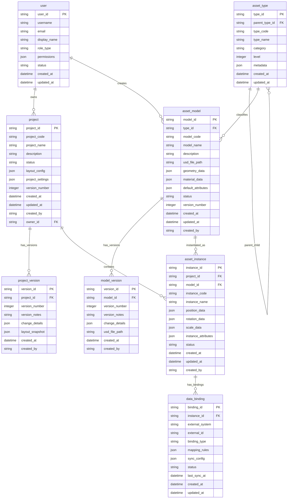

# AI Factory Creator项目 - 数据模型与业务对象

> **文档类型**: 数据规范  
> **最后更新**: 2026-04-02  
> **版本**: v2.0  
> **适用范围**: AI Factory Creator项目开发团队、数据库设计人员、系统架构师

---

## 一、核心业务对象关系图

### 1.1 整体ER图

---

## 二、核心业务对象定义

### 2.1 资产类型 (asset_type)
资产类型用于对3D资产模型进行分类，形成树级结构的分类体系。支持产线、设备等不同层级的分类。

| 字段名 | 类型 | 必填 | 默认值 | 描述 | 示例 |
|--------|------|------|--------|------|------|
| type_id | VARCHAR(36) | 是 | UUID() | 类型唯一标识 | "at_001" |
| parent_type_id | VARCHAR(36) | 否 | NULL | 父类型ID，支持树结构 | "at_001" |
| type_code | VARCHAR(50) | 是 | - | 类型编码，业务唯一 | "PRODUCTION_LINE" |
| type_name | VARCHAR(100) | 是 | - | 类型名称 | "产线类型" |
| category | VARCHAR(50) | 是 | - | 大类分类：EQUIPMENT, PRODUCTION_LINE, FACTORY | "PRODUCTION_LINE" |
| level | INTEGER | 是 | 0 | 层级深度，根节点为0 | 1 |
| metadata | JSON | 否 | {} | 扩展元数据，如图标、颜色等 | {"icon": "line.svg", "color": "#FF0000"} |
| is_system | BOOLEAN | 是 | false | 是否为系统预置类型（系统类型不可删除） | false |
| sort_order | INTEGER | 是 | 0 | 同层级排序序号，从小到大 | 1 |
| created_at | DATETIME | 是 | CURRENT_TIMESTAMP | 创建时间 | "2025-12-28 10:00:00" |
| updated_at | DATETIME | 是 | CURRENT_TIMESTAMP | 更新时间 | "2025-12-28 10:00:00" |

**业务规则**:
1. 同一parent_type_id下type_code必须唯一
2. 分类树深度建议不超过5层
3. 删除类型时需要检查是否有资产模型引用
4. 系统预置类型（is_system=true）不可删除，用户可添加子类型；用户可创建自定义类型（is_system=false）
5. 资产类型支持用户通过管理界面进行增删改查，实现类型定义的灵活扩展

### 2.2 资产模型 (asset_model)
资产模型是存储在资产库中的"蓝图"，描述一类资产的通用属性、几何模型和默认配置。模型本身不绑定具体工厂，是跨工厂项目复用的标准资源。

| 字段名 | 类型 | 必填 | 默认值 | 描述 | 示例 |
|--------|------|------|--------|------|------|
| model_id | VARCHAR(36) | 是 | UUID() | 模型唯一标识 | "am_001" |
| type_id | VARCHAR(36) | 是 | - | 资产类型ID | "at_001" |
| model_code | VARCHAR(50) | 是 | - | 模型编码，在类型内唯一 | "CNC_MACHINE_001" |
| model_name | VARCHAR(100) | 是 | - | 模型名称 | "CNC加工中心" |
| description | TEXT | 否 | NULL | 模型详细描述 | "五轴CNC加工中心，适用于精密零件加工" |
| usd_file_path | VARCHAR(500) | 是 | - | USD文件存储路径 | "/assets/models/cnc_machine.usd" |
| geometry_data | JSON | 是 | {} | 几何数据摘要（顶点数、面数、包围盒等） | {"vertex_count": 1000, "bounding_box": {...}} |
| material_data | JSON | 是 | {} | 材质数据 | {"materials": [{...}]} |
| default_attributes | JSON | 是 | {} | 默认业务属性，JSON格式，键为参数编码(parameter_code)，值为参数值。必须符合资产类型参数定义的数据类型和约束。 | {"power": "5kW", "weight": "2000kg", "temperature": 25.0} |
| status | VARCHAR(20) | 是 | "DRAFT" | 状态：DRAFT, ACTIVE, INACTIVE, ARCHIVED | "ACTIVE" |
| version_number | INTEGER | 是 | 1 | 当前版本号 | 2 |
| created_at | DATETIME | 是 | CURRENT_TIMESTAMP | 创建时间 | "2025-12-28 10:00:00" |
| updated_at | DATETIME | 是 | CURRENT_TIMESTAMP | 更新时间 | "2025-12-28 10:00:00" |
| created_by | VARCHAR(36) | 是 | - | 创建用户ID | "user_001" |

**业务规则**:
1. 同一type_id下model_code必须唯一
2. 状态为ACTIVE的模型才可被工厂项目引用
3. USD文件必须包含完整的几何和材质信息
4. default_attributes中的参数必须符合资产类型（通过type_id关联）的参数定义（asset_type_parameter），包括数据类型、约束等
5. 参数值必须通过验证，必填参数（required=true）必须有值，枚举类型值必须在约束的options范围内

### 2.3 模型版本 (model_version)
记录资产模型的版本历史，支持版本追溯、回滚和比较。

| 字段名 | 类型 | 必填 | 默认值 | 描述 | 示例 |
|--------|------|------|--------|------|------|
| version_id | VARCHAR(36) | 是 | UUID() | 版本唯一标识 | "mv_001" |
| model_id | VARCHAR(36) | 是 | - | 模型ID | "am_001" |
| version_number | INTEGER | 是 | - | 版本号，从1开始递增 | 2 |
| version_notes | TEXT | 否 | NULL | 版本说明 | "更新了材质贴图，优化了渲染性能" |
| change_details | JSON | 是 | {} | 变更详情 | {"attributes_updated": ["color"], "geometry_changed": true} |
| usd_file_path | VARCHAR(500) | 是 | - | 该版本USD文件路径 | "/assets/models/cnc_machine_v2.usd" |
| created_at | DATETIME | 是 | CURRENT_TIMESTAMP | 创建时间 | "2025-12-28 10:00:00" |
| created_by | VARCHAR(36) | 是 | - | 创建用户ID | "user_001" |

**业务规则**:
1. 版本号不可重复，必须严格递增
2. 每次模型更新必须创建新版本记录
3. 版本文件独立存储，支持历史版本查看

### 2.4 工厂项目 (project)
用于承载具体工厂的建模和将资源实例与业务系统中相关数据绑定的独立项目单元，是资产实例的载体。

| 字段名 | 类型 | 必填 | 默认值 | 描述 | 示例 |
|--------|------|------|--------|------|------|
| project_id | VARCHAR(36) | 是 | UUID() | 项目唯一标识 | "proj_001" |
| project_code | VARCHAR(50) | 是 | - | 项目编码，组织内唯一 | "FACTORY_SHANGHAI_2025" |
| project_name | VARCHAR(100) | 是 | - | 项目名称 | "上海智能工厂布局项目" |
| description | TEXT | 否 | NULL | 项目描述 | "上海新工厂的数字化布局设计与优化项目" |
| status | VARCHAR(20) | 是 | "DRAFT" | 状态：DRAFT, IN_PROGRESS, REVIEW, PUBLISHED, ARCHIVED | "IN_PROGRESS" |
| layout_config | JSON | 是 | {} | 布局配置（工厂尺寸、坐标系等） | {"width": 100, "height": 50, "unit": "meter"} |
| project_settings | JSON | 是 | {} | 项目设置（权限、集成配置等） | {"permissions": {...}, "integrations": {...}} |
| version_number | INTEGER | 是 | 1 | 当前版本号 | 3 |
| created_at | DATETIME | 是 | CURRENT_TIMESTAMP | 创建时间 | "2025-12-28 10:00:00" |
| updated_at | DATETIME | 是 | CURRENT_TIMESTAMP | 更新时间 | "2025-12-28 10:00:00" |
| created_by | VARCHAR(36) | 是 | - | 创建用户ID | "user_001" |
| owner_id | VARCHAR(36) | 是 | - | 项目负责人ID | "user_002" |

**业务规则**:
1. project_code在组织内必须唯一
2. 只有PUBLISHED状态的项目才能部署到生产环境
3. 项目删除需要先删除所有资产实例

### 2.5 项目版本 (project_version)
记录工厂项目的版本历史，支持协作编辑和变更追踪。

| 字段名 | 类型 | 必填 | 默认值 | 描述 | 示例 |
|--------|------|------|--------|------|------|
| version_id | VARCHAR(36) | 是 | UUID() | 版本唯一标识 | "pv_001" |
| project_id | VARCHAR(36) | 是 | - | 项目ID | "proj_001" |
| version_number | INTEGER | 是 | - | 版本号，从1开始递增 | 3 |
| version_notes | TEXT | 是 | - | 版本说明 | "添加了新的包装产线，优化了物流路径" |
| change_details | JSON | 是 | {} | 变更详情 | {"instances_added": 5, "instances_modified": 2} |
| layout_snapshot | JSON | 是 | {} | 布局快照（实例位置、配置等） | {"instances": [...], "layout": {...}} |
| created_at | DATETIME | 是 | CURRENT_TIMESTAMP | 创建时间 | "2025-12-28 10:00:00" |
| created_by | VARCHAR(36) | 是 | - | 创建用户ID | "user_001" |

**业务规则**:
1. 每次项目保存（手动或自动）可创建版本记录
2. 版本快照包含完整的布局状态，支持完整恢复
3. 协作编辑时，每个用户的保存都创建独立版本

### 2.6 资产实例 (asset_instance)
资产实例是在具体工厂项目中，根据资产模型创建的实际对象。实例继承了模型的默认属性，同时拥有独立的实例业务属性、空间位置以及与其他实例的层级关系。

| 字段名 | 类型 | 必填 | 默认值 | 描述 | 示例 |
|--------|------|------|--------|------|------|
| instance_id | VARCHAR(36) | 是 | UUID() | 实例唯一标识 | "inst_001" |
| project_id | VARCHAR(36) | 是 | - | 所属项目ID | "proj_001" |
| model_id | VARCHAR(36) | 是 | - | 源模型ID | "am_001" |
| instance_code | VARCHAR(50) | 是 | - | 实例编码，项目内唯一 | "CNC_MACHINE_001" |
| instance_name | VARCHAR(100) | 是 | - | 实例名称 | "1号CNC加工中心" |
| position_data | JSON | 是 | {} | 位置坐标（x, y, z） | {"x": 10.5, "y": 0, "z": 5.2} |
| rotation_data | JSON | 是 | {} | 旋转角度（x, y, z, w） | {"x": 0, "y": 90, "z": 0, "w": 1} |
| scale_data | JSON | 是 | {} | 缩放比例（x, y, z） | {"x": 1, "y": 1, "z": 1} |
| instance_attributes | JSON | 是 | {} | 实例特有业务属性 | {"equipment_no": "EQ001", "maintenance_date": "2026-01-01"} |
| status | VARCHAR(20) | 是 | "ACTIVE" | 状态：ACTIVE, INACTIVE, MAINTENANCE | "ACTIVE" |
| created_at | DATETIME | 是 | CURRENT_TIMESTAMP | 创建时间 | "2025-12-28 10:00:00" |
| updated_at | DATETIME | 是 | CURRENT_TIMESTAMP | 更新时间 | "2025-12-28 10:00:00" |
| created_by | VARCHAR(36) | 是 | - | 创建用户ID | "user_001" |

**业务规则**:
1. 同一project_id下instance_code必须唯一
2. 实例继承模型默认属性，可覆盖但不能删除继承属性
3. 位置数据必须符合项目布局约束（不超出边界、不重叠等）

### 2.7 用户 (user)
系统用户，支持多角色权限管理。

| 字段名 | 类型 | 必填 | 默认值 | 描述 | 示例 |
|--------|------|------|--------|------|------|
| user_id | VARCHAR(36) | 是 | UUID() | 用户唯一标识 | "user_001" |
| username | VARCHAR(50) | 是 | - | 用户名，系统唯一 | "ie_engineer_zhang" |
| email | VARCHAR(100) | 是 | - | 邮箱地址 | "zhang@example.com" |
| display_name | VARCHAR(100) | 是 | - | 显示名称 | "张工程师" |
| role_type | VARCHAR(50) | 是 | - | 角色类型：IE_ENGINEER, U3D_ENGINEER, FACTORY_PLANNER, ADMIN | "IE_ENGINEER" |
| permissions | JSON | 是 | {} | 权限配置 | {"can_create_project": true, "can_edit_model": false} |
| status | VARCHAR(20) | 是 | "ACTIVE" | 状态：ACTIVE, INACTIVE, SUSPENDED | "ACTIVE" |
| created_at | DATETIME | 是 | CURRENT_TIMESTAMP | 创建时间 | "2025-12-28 10:00:00" |
| updated_at | DATETIME | 是 | CURRENT_TIMESTAMP | 更新时间 | "2025-12-28 10:00:00" |

**业务规则**:
1. username和email必须在系统内唯一
2. 权限继承自角色，可单独扩展
3. 用户删除采用软删除，保留历史记录

### 2.8 业务数据绑定 (data_binding)
将资产实例与外部业务系统（ERP/MES/WMS）的数据进行关联，实现数字孪生。

| 字段名 | 类型 | 必填 | 默认值 | 描述 | 示例 |
|--------|------|------|--------|------|------|
| binding_id | VARCHAR(36) | 是 | UUID() | 绑定唯一标识 | "bind_001" |
| instance_id | VARCHAR(36) | 是 | - | 资产实例ID | "inst_001" |
| external_system | VARCHAR(50) | 是 | - | 外部系统：ERP, MES, WMS, IOT | "MES" |
| external_id | VARCHAR(100) | 是 | - | 外部系统ID | "MES_EQ001" |
| binding_type | VARCHAR(50) | 是 | - | 绑定类型：REAL_TIME, PERIODIC, MANUAL | "REAL_TIME" |
| mapping_rules | JSON | 是 | {} | 数据映射规则 | {"field_mappings": {...}} |
| sync_config | JSON | 是 | {} | 同步配置 | {"interval": 60, "retry_times": 3} |
| status | VARCHAR(20) | 是 | "ACTIVE" | 状态：ACTIVE, INACTIVE, ERROR | "ACTIVE" |
| last_sync_at | DATETIME | 否 | NULL | 最后同步时间 | "2025-12-28 10:00:00" |
| created_at | DATETIME | 是 | CURRENT_TIMESTAMP | 创建时间 | "2025-12-28 10:00:00" |
| updated_at | DATETIME | 是 | CURRENT_TIMESTAMP | 更新时间 | "2025-12-28 10:00:00" |

**业务规则**:
1. 一个实例可绑定多个外部系统
2. 实时绑定需要确保外部系统接口可用
3. 同步失败时记录错误日志并告警

### 2.9 资产类型参数定义 (asset_type_parameter)
资产类型参数定义表用于定义每种资产类型（如产线、设备、仓库等）所具备的业务参数和技术参数。这些参数决定了资产模型和实例可以拥有哪些属性，并支持不同类型的参数（业务类、技术类等）以及数据验证规则。

| 字段名 | 类型 | 必填 | 默认值 | 描述 | 示例 |
|--------|------|------|--------|------|------|
| parameter_id | VARCHAR(36) | 是 | UUID() | 参数唯一标识 | "param_001" |
| type_id | VARCHAR(36) | 是 | - | 资产类型ID，引用asset_type.type_id | "at_001" |
| parameter_code | VARCHAR(50) | 是 | - | 参数编码，在类型内唯一 | "temperature" |
| parameter_name | VARCHAR(100) | 是 | - | 参数显示名称 | "工作温度" |
| data_type | VARCHAR(20) | 是 | - | 数据类型：STRING, NUMBER, BOOLEAN, ENUM, DATE, DATETIME | "NUMBER" |
| parameter_category | VARCHAR(20) | 是 | - | 参数分类：BUSINESS, TECHNICAL, GEOMETRIC, PHYSICAL, OTHER | "TECHNICAL" |
| required | BOOLEAN | 是 | false | 是否必填 | true |
| default_value | VARCHAR(500) | 否 | NULL | 默认值（字符串形式存储，根据data_type解析） | "25.0" |
| constraints | JSON | 否 | {} | 约束规则（最小值、最大值、枚举值列表、正则表达式等） | {"min": 0, "max": 100, "unit": "°C"} |
| description | TEXT | 否 | NULL | 参数详细描述 | "设备正常工作温度范围，单位摄氏度" |
| order_index | INTEGER | 是 | 0 | 显示顺序，从小到大排序 | 1 |
| status | VARCHAR(20) | 是 | "ACTIVE" | 状态：ACTIVE, INACTIVE | "ACTIVE" |
| created_at | DATETIME | 是 | CURRENT_TIMESTAMP | 创建时间 | "2025-12-28 10:00:00" |
| updated_at | DATETIME | 是 | CURRENT_TIMESTAMP | 更新时间 | "2025-12-28 10:00:00" |
| created_by | VARCHAR(36) | 是 | - | 创建用户ID | "user_001" |

**业务规则**:
1. 同一type_id下parameter_code必须唯一
2. 参数定义状态为ACTIVE时才可在资产模型中使用
3. 参数分类用于UI分组显示和权限控制
4. 约束规则根据data_type动态解析，如NUMBER类型可定义min/max，ENUM类型定义options数组
5. 参数定义被资产模型引用后，不建议删除，可设置为INACTIVE

**使用场景**:
- 定义资产类型的参数模板，例如“回焊炉”类型定义“温度”、“速度”等参数
- 资产模型创建时，根据其资产类型自动加载参数定义，并填写默认值
- 资产实例继承模型的参数值，并可覆盖
- UI根据参数定义动态生成表单字段，包括验证规则和提示信息

---

## 三、字段命名规范

### 3.1 统一前缀

| 对象类型 | 表名前缀 | 字段前缀示例 | 说明 |
|---------|---------|------------|------|
| 资产类型 | asset_type_ | type_code, type_name | 用于3D资产分类 |
| 资产模型 | asset_model_ | model_code, model_name | 3D模型蓝图 |
| 模型版本 | model_version_ | version_number, version_notes | 模型版本历史 |
| 工厂项目 | project_ | project_code, project_name | 工厂布局项目 |
| 项目版本 | project_version_ | version_number, version_notes | 项目版本历史 |
| 资产实例 | asset_instance_ | instance_code, instance_name | 项目中的具体实例 |
| 用户 | user_ | username, email | 系统用户 |
| 业务数据绑定 | data_binding_ | external_system, external_id | 外部系统数据绑定 |
| 系统配置 | sys_config_ | config_key, config_value | 系统配置表 |
| 操作日志 | audit_log_ | action_type, target_id | 操作审计日志 |

### 3.2 常用字段后缀

| 后缀 | 含义 | 示例 |
|------|------|------|
| _id | 主键ID | product_id |
| _no | 业务编号 | po_no, so_no |
| _code | 业务编码 | product_code |
| _name | 名称 | product_name |
| _date | 日期 | order_date |
| _at | 时间戳 | created_at, updated_at |
| _by | 操作人 | created_by, approved_by |
| _amount | 金额 | total_amount |
| _quantity | 数量 | quantity_ordered |
| _price | 单价 | unit_price |
| _rate | 比率 | tax_rate |
| _status | 状态 | status |

### 3.3 日期时间字段标准

| 字段名 | 类型 | 说明 |
|--------|------|------|
| created_at | DATETIME | 创建时间（系统时间） |
| updated_at | DATETIME | 最后更新时间（系统时间） |
| deleted_at | DATETIME | 软删除时间（软删除场景） |
| xxx_date | DATE | 业务日期（如order_date） |
| xxx_time | TIME | 业务时间（如delivery_time） |

### 3.4 状态字段标准

**字段名**: `status`  
**类型**: VARCHAR(20)  
**值格式**: 全大写下划线分隔，如`PENDING_APPROVAL`

---

## 四、枚举值标准定义

### 4.1 资产模型状态枚举

| 枚举类型 | 枚举值 | 说明 |
|---------|--------|------|
| ASSET_MODEL_STATUS | DRAFT | 草稿状态，未完成配置 |
| ASSET_MODEL_STATUS | ACTIVE | 激活状态，可被工厂项目引用 |
| ASSET_MODEL_STATUS | INACTIVE | 停用状态，不可被新项目引用，已有引用仍有效 |
| ASSET_MODEL_STATUS | ARCHIVED | 归档状态，不再使用，仅保留历史记录 |

### 4.2 工厂项目状态枚举

| 枚举类型 | 枚举值 | 说明 |
|---------|--------|------|
| PROJECT_STATUS | DRAFT | 草稿状态，设计中 |
| PROJECT_STATUS | IN_PROGRESS | 进行中，正在编辑 |
| PROJECT_STATUS | REVIEW | 评审中，等待审批 |
| PROJECT_STATUS | PUBLISHED | 已发布，可部署到生产环境 |
| PROJECT_STATUS | ARCHIVED | 已归档，历史项目 |

### 4.3 资产实例状态枚举

| 枚举类型 | 枚举值 | 说明 |
|---------|--------|------|
| ASSET_INSTANCE_STATUS | ACTIVE | 激活状态，正常使用 |
| ASSET_INSTANCE_STATUS | INACTIVE | 停用状态，不显示不参与计算 |
| ASSET_INSTANCE_STATUS | MAINTENANCE | 维护中，临时不可用 |

### 4.4 用户状态枚举

| 枚举类型 | 枚举值 | 说明 |
|---------|--------|------|
| USER_STATUS | ACTIVE | 激活状态，正常使用 |
| USER_STATUS | INACTIVE | 停用状态，无法登录 |
| USER_STATUS | SUSPENDED | 暂停状态，临时限制 |

### 4.5 数据绑定状态枚举

| 枚举类型 | 枚举值 | 说明 |
|---------|--------|------|
| DATA_BINDING_STATUS | ACTIVE | 激活状态，正常同步 |
| DATA_BINDING_STATUS | INACTIVE | 停用状态，不同步 |
| DATA_BINDING_STATUS | ERROR | 错误状态，同步失败 |

### 4.6 用户角色类型枚举

| 枚举类型 | 枚举值 | 说明 |
|---------|--------|------|
| USER_ROLE_TYPE | IE_ENGINEER | IE工程师，负责工厂布局设计 |
| USER_ROLE_TYPE | U3D_ENGINEER | U3D工程师，负责3D模型技术处理 |
| USER_ROLE_TYPE | FACTORY_PLANNER | 工厂规划师，负责整体工厂规划 |
| USER_ROLE_TYPE | ADMIN | 系统管理员，拥有全部权限 |

### 4.7 资产类型分类枚举

| 枚举类型 | 枚举值 | 说明 |
|---------|--------|------|
| ASSET_TYPE_CATEGORY | FACTORY | 工厂级资产，如整个工厂建筑 |
| ASSET_TYPE_CATEGORY | PRODUCTION_LINE | 产线级资产，由多个设备组成 |
| ASSET_TYPE_CATEGORY | EQUIPMENT | 设备级资产，最小生产单元 |
| ASSET_TYPE_CATEGORY | AUXILIARY | 辅助设备，如传送带、货架等 |
| ASSET_TYPE_CATEGORY | UTILITY | 公用设施，如配电箱、空调等 |

### 4.8 数据绑定类型枚举

| 枚举类型 | 枚举值 | 说明 |
|---------|--------|------|
| BINDING_TYPE | REAL_TIME | 实时绑定，数据变化立即同步 |
| BINDING_TYPE | PERIODIC | 周期性绑定，按固定间隔同步 |
| BINDING_TYPE | MANUAL | 手动绑定，用户手动触发同步 |

### 4.9 外部系统类型枚举

| 枚举类型 | 枚举值 | 说明 |
|---------|--------|------|
| EXTERNAL_SYSTEM | ERP | 企业资源计划系统 |
| EXTERNAL_SYSTEM | MES | 制造执行系统 |
| EXTERNAL_SYSTEM | WMS | 仓储管理系统 |
| EXTERNAL_SYSTEM | IOT | 物联网平台 |
| EXTERNAL_SYSTEM | SCADA | 数据采集与监视控制系统 |

### 4.10 参数分类枚举 (PARAMETER_CATEGORY)
参数分类用于区分不同用途的参数，便于UI分组显示和权限管理。

| 枚举类型 | 枚举值 | 说明 |
|---------|--------|------|
| PARAMETER_CATEGORY | BUSINESS | 业务类参数，与生产管理、计划等相关 |
| PARAMETER_CATEGORY | TECHNICAL | 技术类参数，描述设备技术规格 |
| PARAMETER_CATEGORY | GEOMETRIC | 几何类参数，描述尺寸、形状等几何属性 |
| PARAMETER_CATEGORY | PHYSICAL | 物理类参数，描述重量、材料等物理属性 |
| PARAMETER_CATEGORY | SAFETY | 安全类参数，描述安全限制和防护要求 |
| PARAMETER_CATEGORY | OPERATIONAL | 操作类参数，描述运行状态和操作条件 |
| PARAMETER_CATEGORY | OTHER | 其他分类 |

### 4.11 参数数据类型枚举 (PARAMETER_DATA_TYPE)
定义参数值的数据类型，用于UI控件渲染和数据验证。

| 枚举类型 | 枚举值 | 说明 |
|---------|--------|------|
| PARAMETER_DATA_TYPE | STRING | 字符串类型，单行文本输入 |
| PARAMETER_DATA_TYPE | TEXT | 长文本类型，多行文本输入 |
| PARAMETER_DATA_TYPE | NUMBER | 数字类型，可带小数，支持单位 |
| PARAMETER_DATA_TYPE | INTEGER | 整数类型 |
| PARAMETER_DATA_TYPE | BOOLEAN | 布尔类型，开关控件 |
| PARAMETER_DATA_TYPE | ENUM | 枚举类型，下拉选择 |
| PARAMETER_DATA_TYPE | DATE | 日期类型 |
| PARAMETER_DATA_TYPE | DATETIME | 日期时间类型 |
| PARAMETER_DATA_TYPE | FILE | 文件类型，上传文件 |
| PARAMETER_DATA_TYPE | COLOR | 颜色类型，颜色选择器 |

---

## 五、数据一致性规则

### 5.1 引用完整性规则

| 规则编号 | 规则描述 | 约束条件 | 违规处理 |
|----------|----------|----------|----------|
| R001 | 资产模型必须引用有效的资产类型 | asset_model.type_id必须在asset_type.type_id中存在 | 创建/更新时校验，违反则拒绝操作 |
| R002 | 资产实例必须引用有效的资产模型 | asset_instance.model_id必须在asset_model.model_id中存在 | 创建/更新时校验，违反则拒绝操作 |
| R003 | 资产实例必须属于有效的工厂项目 | asset_instance.project_id必须在project.project_id中存在 | 创建/更新时校验，违反则拒绝操作 |
| R004 | 模型版本必须属于有效的资产模型 | model_version.model_id必须在asset_model.model_id中存在 | 创建/更新时校验，违反则拒绝操作 |
| R005 | 项目版本必须属于有效的工厂项目 | project_version.project_id必须在project.project_id中存在 | 创建/更新时校验，违反则拒绝操作 |
| R006 | 数据绑定必须绑定有效的资产实例 | data_binding.instance_id必须在asset_instance.instance_id中存在 | 创建/更新时校验，违反则拒绝操作 |
| R007 | 工厂项目必须有有效的负责人 | project.owner_id必须在user.user_id中存在 | 创建/更新时校验，违反则拒绝操作 |

### 5.2 业务唯一性规则

| 规则编号 | 规则描述 | 约束条件 | 违规处理 |
|----------|----------|----------|----------|
| R101 | 资产类型编码在父类型下必须唯一 | 同一parent_type_id下asset_type.type_code必须唯一 | 创建/更新时校验，违反则拒绝操作 |
| R102 | 资产模型编码在类型内必须唯一 | 同一type_id下asset_model.model_code必须唯一 | 创建/更新时校验，违反则拒绝操作 |
| R103 | 工厂项目编码在组织内必须唯一 | project.project_code在组织内必须唯一 | 创建/更新时校验，违反则拒绝操作 |
| R104 | 资产实例编码在项目内必须唯一 | 同一project_id下asset_instance.instance_code必须唯一 | 创建/更新时校验，违反则拒绝操作 |
| R105 | 用户名必须全局唯一 | user.username必须全局唯一 | 创建/更新时校验，违反则拒绝操作 |
| R106 | 用户邮箱必须全局唯一 | user.email必须全局唯一 | 创建/更新时校验，违反则拒绝操作 |

### 5.3 状态流转规则

| 规则编号 | 规则描述 | 约束条件 | 违规处理 |
|----------|----------|----------|----------|
| R201 | 资产模型必须为ACTIVE状态才能被引用 | 只有status='ACTIVE'的asset_model才能被asset_instance引用 | 创建asset_instance时校验，违反则拒绝操作 |
| R202 | 资产模型必须先禁用才能删除 | 只有status='INACTIVE'的asset_model才能被删除 | 删除操作前校验，违反则拒绝操作 |
| R203 | 工厂项目必须无资产实例才能删除 | 只有无asset_instance引用的project才能被删除 | 删除操作前校验，违反则拒绝操作 |
| R204 | 资产模型版本号必须严格递增 | model_version.version_number必须大于该模型已有最大版本号 | 创建版本时校验，违反则拒绝操作 |
| R205 | 工厂项目版本号必须严格递增 | project_version.version_number必须大于该项目已有最大版本号 | 创建版本时校验，违反则拒绝操作 |

### 5.4 数据同步规则

| 规则编号 | 规则描述 | 约束条件 | 违规处理 |
|----------|----------|----------|----------|
| R301 | 模型变更必须创建新版本 | asset_model的任何变更（除状态外）必须创建新的model_version记录 | 更新操作时自动执行，记录变更详情 |
| R302 | 项目布局变更应创建版本快照 | project.layout_config变更建议创建project_version记录 | 重要变更时提示用户创建版本 |
| R303 | 实时数据绑定需要定期健康检查 | status='ACTIVE'且binding_type='REAL_TIME'的data_binding需要定期检查连接 | 系统定时任务检查，失败时更新status='ERROR' |
| R304 | 实例位置必须在项目边界内 | asset_instance.position_data必须在project.layout_config定义的边界内 | 创建/更新时校验，违反则拒绝操作 |

### 5.5 继承与覆盖规则

| 规则编号 | 规则描述 | 约束条件 | 违规处理 |
|----------|----------|----------|----------|
| R401 | 实例继承模型默认属性 | asset_instance自动继承asset_model.default_attributes | 创建实例时自动复制，后续模型变更不影响已有实例 |
| R402 | 实例可覆盖模型默认属性 | asset_instance.instance_attributes可覆盖继承的属性值 | 实例属性优先级高于模型默认属性 |
| R403 | 实例不能删除继承属性 | asset_instance不能删除从模型继承的属性定义 | 只能覆盖值，不能删除属性定义 |
| R404 | 模型结构变更需要评估实例影响 | asset_model.geometry_data变更时需要评估对已有asset_instance的影响 | 变更时提示影响范围，用户确认后执行 |

### 5.6 审计与追溯规则

| 规则编号 | 规则描述 | 约束条件 | 违规处理 |
|----------|----------|----------|----------|
| R501 | 所有创建操作必须记录创建人和时间 | 所有表的created_at和created_by字段必须填写 | 系统自动记录，不允许为空 |
| R502 | 所有更新操作必须记录更新时间和操作人 | 所有表的updated_at字段必须自动更新 | 系统自动更新，不允许手动修改 |
| R503 | 重要业务操作必须记录审计日志 | 创建/更新/删除资产模型、工厂项目等核心操作必须记录审计日志 | 业务逻辑层自动记录 |
| R504 | 数据删除必须支持软删除或完整追溯 | 重要业务数据删除必须采用软删除或保留完整版本历史 | 根据数据类型采用不同策略 |

---

## 六、数据设计最佳实践

### 6.1 表设计原则
- 单表单一职责
- 头行分离（订单头/订单行）
- 冗余适度（性能vs规范）
- 预留扩展字段

### 6.2 索引设计原则
- 主键索引：自增ID
- 唯一索引：业务编号
- 普通索引：外键、状态、日期
- 组合索引：高频查询条件

### 6.3 分区分表策略
- 按时间分区：订单/流水（按月/季度）
- 按组织分区：库存（按仓库）
- 历史归档：1年以上数据归档

### 6.4 性能优化建议
- 避免大事务
- 批量操作代替循环
- 适当数据冗余（如订单冗余商品名称）
- 缓存热数据

---

## 七、UI交互考虑

基于上述数据模型设计，UI交互需要充分考虑资产类型的动态性、参数定义的多样性和用户配置的灵活性。

### 7.1 资产类型管理界面
- **树形结构展示**：以树形结构展示资产类型层级，支持展开/折叠、拖拽排序（依据sort_order）
- **类型增删改查**：用户可添加、编辑、删除自定义类型（is_system=false），系统预置类型仅允许添加子类型
- **类型属性配置**：编辑类型时配置图标、颜色等元数据（metadata字段）
- **参数定义管理**：在类型详情页内嵌参数定义管理，支持参数的增删改查、排序、启用/禁用

### 7.2 资产模型参数表单动态生成
- **表单按参数分类分组**：根据parameter_category将参数分组显示（如“业务参数”、“技术参数”、“几何参数”等），使用标签页或分组面板
- **动态控件渲染**：根据data_type渲染不同的输入控件：
  - STRING/TEXT：文本输入框（单行/多行）
  - NUMBER/INTEGER：数字输入框，可附带单位显示（从constraints中读取unit）
  - BOOLEAN：开关或复选框
  - ENUM：下拉选择框，选项从constraints.options加载
  - DATE/DATETIME：日期/时间选择器
  - FILE：文件上传组件
  - COLOR：颜色选择器
- **实时验证**：根据constraints进行实时验证（必填、最小值、最大值、正则表达式等），错误提示即时显示
- **默认值填充**：新建模型时自动填充default_value，用户可修改

### 7.3 资产实例参数继承与覆盖
- **继承显示**：实例参数表单首先展示继承自模型的默认值，并明确标识“继承自模型”
- **覆盖机制**：用户可修改参数值，修改后该参数标记为“已覆盖”，并提供“恢复继承”按钮
- **批量操作**：支持批量覆盖多个参数，或批量恢复继承

### 7.4 参数定义变更的向后兼容
- **参数定义修改影响评估**：当参数定义（如数据类型、约束）被修改时，系统应检查已有资产模型和实例是否受影响，并提示用户
- **版本化参数定义**：考虑参数定义版本化，确保历史模型和实例的参数定义不变，新模型采用新定义

### 7.5 用户配置体验
- **引导式配置**：提供资产类型配置向导，引导用户完成类型创建、参数定义、默认值设置
- **模板功能**：支持从现有资产类型复制参数定义，快速创建新类型
- **导入导出**：支持资产类型和参数定义的导入导出，便于团队间共享配置

### 7.6 搜索与筛选
- **按参数搜索**：在资产库中可根据参数值进行筛选（如“温度>30°C的设备”）
- **参数列自定义**：在资产列表视图中，允许用户选择显示哪些参数列，并支持排序

通过以上UI交互设计，确保系统能够灵活适应未来资产类型的扩展，同时提供良好的用户体验，满足不同角色用户（IE工程师、工厂规划师等）的操作需求。
