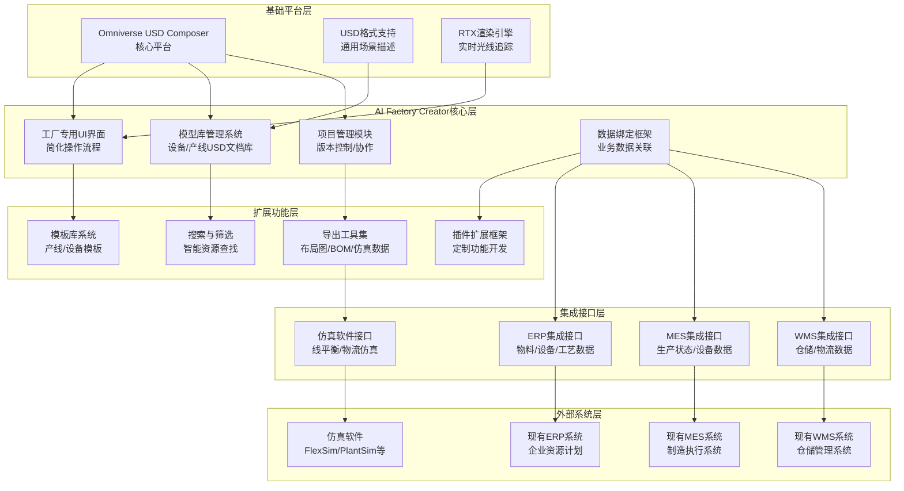
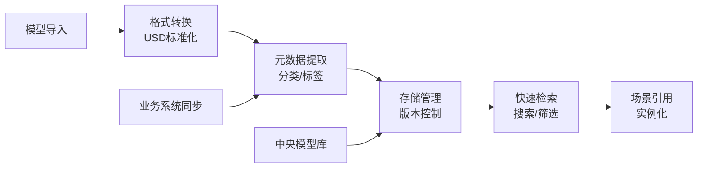
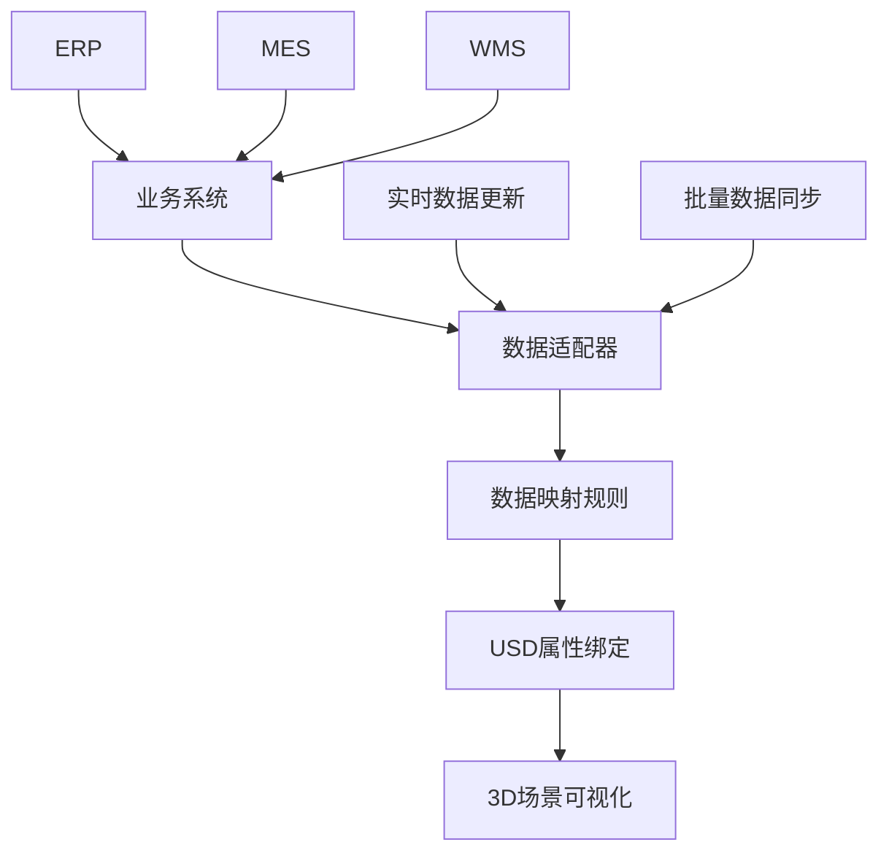
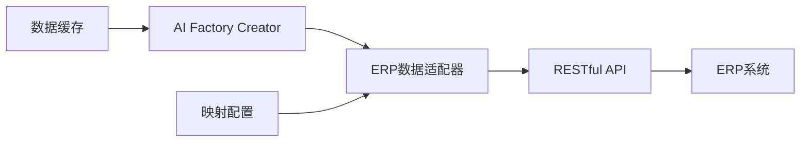

# AI Factory Creator - 技术架构与系统设计

> **文档类型**: 技术架构资料  
> **最后更新**: 2026-03-31  
> **技术负责人**: [待填写]  
> **适用范围**: AI Factory Creator开发团队、技术架构评审

---

## 一、技术架构概述

### 1.1 项目定位
AI Factory Creator是基于**NVIDIA Omniverse USD Composer**构建的工厂数字孪生设计工具，专注于工厂布局设计的专业化和效率提升。项目不是从零开发3D引擎，而是利用成熟的Omniverse平台，针对工厂场景进行定制化封装和扩展。

### 1.2 核心设计原则
1. **平台化**: 基于Omniverse USD Composer，避免重复建设基础3D能力
2. **专业化**: 聚焦工厂布局设计场景，提供行业专用功能
3. **集成化**: 与现有业务系统（ERP/MES/WMS）无缝集成
4. **易用性**: 降低3D设计门槛，IE工程师无需专业3D建模知识
5. **可扩展**: 支持插件化扩展，适应不同工厂场景需求

### 1.3 技术架构全景图


---

## 二、技术栈与平台选型

### 2.1 核心平台：NVIDIA Omniverse USD Composer

#### 平台优势
+ **USD原生支持**: 通用场景描述格式，行业标准
+ **高性能渲染**: RTX实时光线追踪，大规模场景渲染
+ **成熟编辑能力**: 拖拽式编辑、多视图、测量工具等
+ **扩展架构**: 插件化设计，支持自定义功能开发
+ **跨平台**: Windows/macOS/Linux支持

#### 平台提供的基础能力
| 能力类别 | 具体功能 | AI Factory Creator使用方式 |
|----------|----------|---------------------------|
| **3D渲染** | USD格式渲染、实时光线追踪 | 直接使用，针对工厂场景优化材质和光照 |
| **场景编辑** | 拖拽、旋转、缩放、对齐、分布 | 直接使用，增加工厂专用操作快捷方式 |
| **视图系统** | 顶视图、前视图、3D视图、场景漫游 | 直接使用，优化工厂布局查看模式 |
| **测量工具** | 距离测量、面积计算、角度测量 | 直接使用，增加工厂常用测量预设 |
| **数据交换** | USD导入/导出、格式转换 | 基于USD扩展工厂专用数据格式 |

### 2.2 AI Factory Creator技术栈

#### 前端技术
| 组件 | 技术选型 | 说明 |
|------|----------|------|
| **UI框架** | Omniverse Extension框架 | 基于Omniverse的扩展开发框架 |
| **界面语言** | Python + Qt/PySide | Omniverse标准扩展开发语言 |
| **3D交互** | Omniverse Kit SDK | 3D场景操作和交互开发 |
| **数据绑定** | USD Python API | USD场景数据编程接口 |

#### 后端技术
| 组件 | 技术选型 | 说明 |
|------|----------|------|
| **模型库存储** | 本地文件系统 + 网络存储 | USD文件存储和管理 |
| **项目数据** | SQLite数据库 | 项目元数据、版本信息存储 |
| **业务数据缓存** | Redis/Memcached | 业务系统数据缓存，提高性能 |
| **文件索引** | Elasticsearch/Lucene | 模型库快速搜索和筛选 |

#### 集成技术
| 集成类型 | 技术方案 | 说明 |
|----------|----------|------|
| **ERP集成** | RESTful API + OData | 读取物料、设备、工艺数据 |
| **MES集成** | WebSocket + MQTT | 实时生产状态数据订阅 |
| **WMS集成** | RESTful API + 文件接口 | 仓储布局和物流数据 |
| **仿真软件** | 文件导出（XML/JSON） | 导出到FlexSim、PlantSim等 |

### 2.3 开发环境与工具链

#### 开发环境
+ **操作系统**: Windows 10/11, macOS 12+
+ **Omniverse版本**: Omniverse Kit 105+，USD Composer扩展
+ **Python版本**: Python 3.9+
+ **开发工具**: VS Code/PyCharm，Omniverse Code

#### 构建与部署
+ **版本控制**: Git + GitHub/GitLab
+ **持续集成**: Jenkins/GitHub Actions
+ **打包工具**: Omniverse Extension打包工具
+ **安装部署**: Omniverse Launcher分发

#### 测试工具
+ **单元测试**: pytest，Omniverse测试框架
+ **集成测试**: 自动化API测试，场景测试
+ **性能测试**: 大规模场景加载测试，渲染性能测试
+ **兼容性测试**: 不同Omniverse版本兼容性测试

---

## 三、系统架构设计

### 3.1 整体架构分层

#### 3.1.1 表现层（UI Layer）
+ **主界面框架**: 工厂专用布局，简化Omniverse原生界面
+ **工具栏定制**: 工厂常用工具快速访问
+ **属性面板**: 设备属性、产线参数编辑
+ **资源管理器**: 模型库浏览和搜索界面
+ **项目视图**: 项目文件管理和版本控制界面

#### 3.1.2 应用层（Application Layer）
+ **场景管理模块**: 工厂场景创建、保存、加载
+ **模型库模块**: 设备模型和产线模型管理
+ **项目管理模块**: 项目版本控制、协作管理
+ **数据绑定模块**: 业务数据与3D场景关联
+ **导出工具模块**: 布局图、BOM清单、仿真数据导出

#### 3.1.3 服务层（Service Layer）
+ **USD服务**: USD文件解析、合并、优化
+ **渲染服务**: 场景渲染优化、LOD管理
+ **搜索服务**: 模型库全文搜索、智能推荐
+ **数据服务**: 业务数据缓存、同步服务
+ **集成服务**: 外部系统接口代理

#### 3.1.4 数据层（Data Layer）
+ **本地存储**: USD文件存储、SQLite数据库
+ **网络存储**: 中央模型库、共享模板库
+ **缓存存储**: Redis缓存业务数据
+ **索引存储**: Elasticsearch搜索索引

### 3.2 核心模块设计

#### 3.2.1 模型库管理系统


**关键设计点**:
+ **格式兼容**: 支持主流3D格式（FBX、OBJ、STEP）转换为USD
+ **元数据标准化**: 定义设备模型的标准属性集
+ **版本控制**: 模型版本管理，支持回滚和比较
+ **权限管理**: 模型使用权限控制，支持企业内部共享

#### 3.2.2 数据绑定框架


**关键设计点**:
+ **松耦合设计**: 业务系统变更不影响3D场景
+ **映射规则配置**: 支持图形化配置数据映射关系
+ **实时更新**: 支持业务数据变化实时反映到3D场景
+ **数据验证**: 绑定数据格式和范围验证

#### 3.2.3 项目管理模块
**项目数据结构**:
```python
class FactoryProject:
    project_id: str          # 项目唯一标识
    project_name: str        # 项目名称
    version: str            # 版本号
    created_time: datetime  # 创建时间
    modified_time: datetime # 修改时间
    
    # 场景数据
    usd_scene: USDScene     # USD场景数据
    layout_data: dict       # 布局数据
    
    # 业务数据
    equipment_list: list    # 设备列表
    production_line: dict   # 产线配置
    material_flow: dict     # 物料流数据
    
    # 元数据
    tags: list              # 项目标签
    description: str        # 项目描述
    thumbnail: bytes        # 缩略图
```

**版本管理策略**:
+ **增量存储**: 只存储版本间差异，减少存储空间
+ **分支管理**: 支持实验分支和发布分支
+ **合并冲突**: 可视化冲突解决工具
+ **历史追溯**: 完整修改历史记录

### 3.3 数据流设计

#### 3.3.1 模型库数据流
```
外部3D模型 → 格式转换 → USD标准化 → 元数据提取 → 分类存储 → 索引建立 → 场景引用
```

#### 3.3.2 业务数据流
```
ERP/MES/WMS → API调用 → 数据适配 → 格式转换 → 缓存存储 → 场景绑定 → 3D可视化
```

#### 3.3.3 项目数据流
```
用户操作 → 场景变更 → USD更新 → 版本快照 → 本地保存 → 云端同步 → 共享协作
```

---

## 四、集成架构设计

### 4.1 与现有ERP系统集成

#### 4.1.1 集成范围
+ **设备主数据**: 设备编码、名称、规格、技术参数
+ **物料主数据**: 物料编码、名称、规格、库存信息
+ **工艺路线**: 工序定义、设备分配、工时标准
+ **生产订单**: 生产任务、计划数量、计划时间

#### 4.1.2 集成方式


**技术实现**:
+ **接口协议**: RESTful API，OData标准查询
+ **认证授权**: OAuth 2.0，API密钥
+ **数据同步**: 增量同步，定时全量同步
+ **错误处理**: 重试机制，数据补偿

#### 4.1.3 数据映射示例
| USD场景属性 | ERP数据字段 | 映射规则 |
|-------------|------------|----------|
| `设备实例.型号` | `设备主数据.设备型号` | 直接映射 |
| `设备实例.状态` | `设备状态表.运行状态` | 状态代码转换 |
| `物料流.物料编码` | `物料主数据.物料编码` | 直接映射 |
| `产线.标准工时` | `工艺路线.标准工时` | 单位转换 |

### 4.2 与MES系统集成

#### 4.2.1 集成范围
+ **实时状态**: 设备运行状态、故障信息
+ **生产进度**: 订单完成数量、良品率
+ **质量数据**: 检测结果、不良品信息
+ **能耗数据**: 设备能耗、环境数据

#### 4.2.2 集成方式
+ **实时数据**: WebSocket/MQTT实时推送
+ **历史数据**: RESTful API批量查询
+ **事件通知**: 设备故障、生产异常实时通知

### 4.3 与仿真软件集成

#### 4.3.1 支持格式
+ **FlexSim**: .fsm文件格式
+ **Plant Simulation**: .spp文件格式
+ **AnyLogic**: 标准XML格式
+ **通用格式**: CSV、JSON、XML

#### 4.3.2 导出内容
+ **布局数据**: 设备位置、朝向、连接关系
+ **物料流**: 物料流向、流量、节拍
+ **设备参数**: 加工时间、故障率、能耗
+ **人员配置**: 工作岗位、行走路径

---

## 五、性能与可扩展性设计

### 5.1 性能指标

#### 5.1.1 场景性能
| 指标 | 目标值 | 测量方法 |
|------|--------|----------|
| **场景加载时间** | 1000设备模型 < 10秒 | 从点击到场景可操作 |
| **操作响应时间** | 平移/旋转 < 200ms | 用户操作到视觉反馈 |
| **帧率** | 复杂场景 ≥ 30 FPS | 60Hz显示器下的渲染帧率 |
| **内存占用** | 1000设备模型 < 8GB | 应用程序内存使用 |

#### 5.1.2 数据性能
| 指标 | 目标值 | 测量方法 |
|------|--------|----------|
| **模型库搜索** | 10000模型 < 1秒 | 关键词搜索响应时间 |
| **业务数据同步** | 1000设备 < 5秒 | ERP数据同步完成时间 |
| **项目保存** | 100MB场景 < 3秒 | 本地保存完成时间 |
| **数据导出** | 布局图导出 < 2秒 | PDF/图片格式导出 |

### 5.2 可扩展性设计

#### 5.2.1 插件架构
```python
# 插件接口定义
class IAFCExtension:
    def initialize(self, context):
        """插件初始化"""
        pass
    
    def get_menu_items(self):
        """返回插件菜单项"""
        return []
    
    def get_tool_items(self):
        """返回插件工具栏项"""
        return []
    
    def get_property_editors(self):
        """返回插件属性编辑器"""
        return []
```

#### 5.2.2 扩展点设计
+ **工具扩展**: 自定义工厂设计工具
+ **导入导出扩展**: 支持新格式导入导出
+ **数据源扩展**: 支持新的业务数据源
+ **分析扩展**: 自定义布局分析算法
+ **可视化扩展**: 自定义数据可视化组件

#### 5.2.3 配置化管理
+ **界面配置**: 工具栏、菜单可配置
+ **数据映射配置**: 图形化数据映射配置界面
+ **模板配置**: 产线模板、设备组合模板管理
+ **集成配置**: 外部系统连接配置

### 5.3 兼容性设计

#### 5.3.1 Omniverse版本兼容
+ **最低版本**: Omniverse Kit 105
+ **推荐版本**: Omniverse Kit 最新稳定版
+ **版本检测**: 启动时检查兼容性
+ **降级处理**: 旧版本项目在新版本中的兼容处理

#### 5.3.2 操作系统兼容
+ **Windows**: Windows 10 (21H2)+, Windows 11
+ **macOS**: macOS 12 (Monterey)+
+ **硬件要求**: RTX显卡推荐，支持光线追踪

#### 5.3.3 业务系统兼容
+ **ERP系统**: 支持主流ERP系统（SAP、Oracle、用友、金蝶）
+ **数据格式**: 支持常见数据库和API格式
+ **协议支持**: RESTful、SOAP、OData、MQTT等

---

## 六、安全与可靠性设计

### 6.1 安全设计

#### 6.1.1 数据安全
+ **本地加密**: 敏感项目数据本地加密存储
+ **传输加密**: HTTPS/TLS数据传输加密
+ **访问控制**: 基于角色的数据访问权限
+ **操作审计**: 关键操作日志记录

#### 6.1.2 系统安全
+ **代码签名**: 插件和扩展包数字签名
+ **沙箱运行**: 第三方插件沙箱环境运行
+ **输入验证**: 所有外部输入严格验证
+ **漏洞管理**: 定期安全漏洞扫描和修复

### 6.2 可靠性设计

#### 6.2.1 错误处理
+ **异常捕获**: 全面的异常捕获和恢复机制
+ **数据备份**: 自动数据备份和恢复
+ **事务处理**: 关键操作事务性保证
+ **优雅降级**: 功能不可用时的优雅处理

#### 6.2.2 容错设计
+ **断点续传**: 大文件传输断点续传
+ **数据校验**: 数据传输完整性校验
+ **超时重试**: 网络操作超时重试机制
+ **故障转移**: 关键服务故障转移

### 6.3 监控与维护

#### 6.3.1 系统监控
+ **性能监控**: CPU、内存、GPU使用监控
+ **错误监控**: 应用程序错误日志收集
+ **使用统计**: 功能使用频率统计
+ **用户反馈**: 用户问题反馈收集

#### 6.3.2 维护策略
+ **自动更新**: 插件和扩展包自动更新
+ **配置备份**: 用户配置自动备份
+ **数据清理**: 临时文件和缓存定期清理
+ **日志管理**: 日志文件大小和保留策略

---

## 七、实施路线图

### 7.1 技术实施阶段

#### Phase 1: 基础框架搭建 (2个月)
+ **环境搭建**: 开发环境、构建环境
+ **核心框架**: 扩展框架、基础UI
+ **基础功能**: 场景管理、基本编辑
+ **模型库基础**: 模型导入、基本管理

#### Phase 2: 核心功能开发 (4个月)
+ **模型库完善**: 搜索、分类、版本管理
+ **项目管理**: 项目创建、保存、版本控制
+ **数据绑定框架**: 基础数据绑定功能
+ **模板系统**: 基础模板管理

#### Phase 3: 高级功能开发 (3个月)
+ **高级编辑工具**: 工厂专用工具开发
+ **集成接口**: ERP/MES集成接口开发
+ **导出工具**: 布局图、BOM清单导出
+ **性能优化**: 大规模场景优化

#### Phase 4: 系统完善 (3个月)
+ **插件框架**: 插件扩展机制
+ **协作功能**: 多人协作支持
+ **文档培训**: 用户文档、培训材料
+ **系统测试**: 全面测试和优化

### 7.2 技术风险与应对

#### 7.2.1 技术风险
+ **Omniverse版本兼容**: Omniverse API变动影响
+ **性能瓶颈**: 大规模场景渲染性能
+ **集成复杂性**: 多系统集成数据一致性
+ **用户体验**: 专业工具易用性平衡

#### 7.2.2 应对措施
+ **版本适配**: 紧跟Omniverse更新，及时适配
+ **性能优化**: LOD、场景分割、异步加载
+ **集成测试**: 完善的集成测试方案
+ **用户测试**: 早期用户参与测试和反馈

---

## 八、附录

### 8.1 技术参考资料
+ [Omniverse Developer Documentation](https://docs.omniverse.nvidia.com/)
+ [USD Documentation](https://graphics.pixar.com/usd/docs/index.html)
+ [Omniverse Kit API Reference](https://docs.omniverse.nvidia.com/kit/docs/api/index.html)
+ [Python USD API](https://graphics.pixar.com/usd/docs/api/index.html)

### 8.2 相关文档
+ [项目定义与项目背景信息.md](./2.%20项目定义&项目背景信息.md)
+ [系统功能清单和上下游集成系统.md](./6.%20系统功能清单和上下游集成系统.md)

### 8.3 文档历史
| 版本 | 日期 | 修改人 | 修改内容 |
|------|------|--------|---------|
| v1.0 | 2026-03-31 | AI助手 | 初始版本 |

