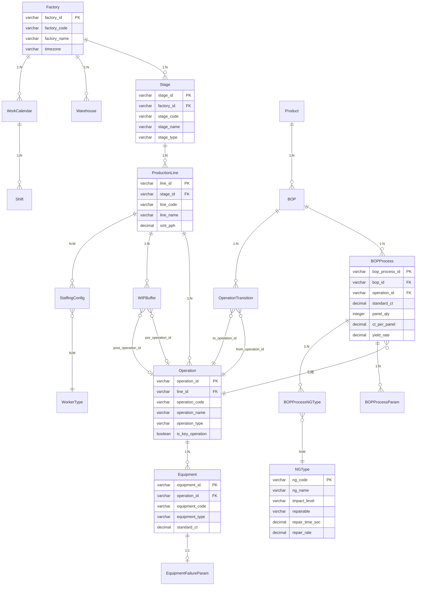

# AI Factory - 「运营模拟」模块 - 数据模型与业务对象

> **文档类型**: 数据规范  
> **最后更新**: 2026-04-10  
> **版本**: v2.6  
> **适用范围**: AI Factory开发团队、数据库设计人员、系统架构师

---

## 一、核心业务对象关系图

### 1.1 整体ER图

```
【基础数据层（主数据平台只读）】

Factory（工厂）
  ├── Stage（制程） 1:N                          ← 如 SMT制程、后工段
  │     └── ProductionLine（线体） 1:N            ← 如 A面线、B面线
  │           ├── Operation（工序） 1:N           ← 如 锡膏印刷、贴片、回流焊
  │           │     └── Equipment（设备/工位） 1:N
  │           │           └── EquipmentFailureParam（故障参数） 1:1
  │           ├── WIPBuffer（线边仓） 1:N
  │           │     ├── pre_operation_id → Operation（前置工序：完工后放料）
  │           │     └── post_operation_id → Operation（后置工序：开工前取料）
  │           └── StaffingConfig（人员配置） N:M via WorkerType
  ├── Warehouse（仓库） 1:N
  └── WorkCalendar（工作日历） 1:N
        └── Shift（班次） 1:N

Product（产品）
  └── BOP（工艺路线）N:1（同产品可有多版本，只有一个激活）
        ├── BOPProcess（BOP工序节点） 1:N → 引用 Operation
        │     ├── BOPProcessParam（工序关键参数） 1:N
        │     └── BOPProcessNGType（工序-不良类型关联） N:M → NGType
        └── OperationTransition（工序间接续时间） 1:N

NGType（不良类型字典）← 主数据，可被多个 BOPProcess 引用
Material（物料）
WorkerType（工种）

```

**主要业务对象分类说明**:

| 分类 | 说明 | 读写权限 |
|------|------|----------|
| **基础数据层** | 工厂建模、BOP、设备参数等由主数据平台统一管理 | 运营模拟**只读**，本地缓存；需修改须前往主数据平台 |
| **业务数据快照层** | 来自 ERP/MES/WMS 的快照或手工导入，驱动单次仿真 | 导入后**只读**（模拟期间不再实时同步） |

### 1.2 Mermaid ER 图

> 按层级拆分为两张图，避免单图过于密集。

#### 基础数据层



---

## 二、核心业务对象定义

### 2.1 基础数据对象（只读，本地缓存自主数据平台）

#### Factory（工厂）
| 字段名 | 类型 | 必填 | 说明 |
|--------|------|------|------|
| factory_id | VARCHAR(36) | ✓ | 主键（UUID） |
| factory_code | VARCHAR(50) | ✓ | 工厂编码（全局唯一） |
| factory_name | VARCHAR(200) | ✓ | 工厂名称 |
| location | VARCHAR(500) | | 工厂地址 |
| timezone | VARCHAR(50) | ✓ | 时区（如 Asia/Shanghai） |
| status | VARCHAR(20) | ✓ | ACTIVE / INACTIVE |
| created_at | DATETIME | ✓ | 创建时间 |
| updated_at | DATETIME | ✓ | 最后更新时间 |

#### Stage（制程）

> 制程是工厂内的生产区域，如"SMT制程"、"后工段"，一个制程下包含多条平行线体。

| 字段名 | 类型 | 必填 | 说明 |
|--------|------|------|------|
| stage_id | VARCHAR(36) | ✓ | 主键 |
| factory_id | VARCHAR(36) | ✓ | 所属工厂（外键→Factory） |
| stage_code | VARCHAR(50) | ✓ | 制程编码（工厂内唯一） |
| stage_name | VARCHAR(200) | ✓ | 制程名称（如 SMT、后工段） |
| sequence | INTEGER | ✓ | 在工厂生产流中的顺序（从1开始） |
| stage_type | VARCHAR(50) | ✓ | 制程类型：SMT / WAVE_SOLDER / SELECTIVE_SOLDER / MANUAL_ASSEMBLY / BACK_END / OTHER |
| line_count | INTEGER | | 制程下线体总数（汇总） |
| status | VARCHAR(20) | ✓ | ACTIVE / INACTIVE |
| creator_binding_id | VARCHAR(100) | | AI Factory Creator 中的绑定对象 ID（用于3D联动） |
| created_at | DATETIME | ✓ | 创建时间 |
| updated_at | DATETIME | ✓ | 最后更新时间 |

#### ProductionLine（线体）

> 线体是制程内的一条具体生产流水线，如"A面线"、"B面线"。同一制程下的多条线体跑相同工序序列，但设备配置和 CT 可各不相同。

| 字段名 | 类型 | 必填 | 说明 |
|--------|------|------|------|
| line_id | VARCHAR(36) | ✓ | 主键 |
| stage_id | VARCHAR(36) | ✓ | 所属制程（外键→Stage） |
| factory_id | VARCHAR(36) |  | 所属工厂（外键→Factory） |
| line_code | VARCHAR(50) | ✓ | 线体编码（制程内唯一） |
| line_name | VARCHAR(200) | ✓ | 线体名称（如 A面线、B面线） |
| smt_pph | DECIMAL(10,2) | | 线体每小时置件点数（Points Per Hour）；仅父级 stage_type=SMT 时填写；用于 SMT 产能规划分析；制程级总 PPH 可跨线体累加 |
| operation_count | INTEGER | | 线体内工序总数（汇总） |
| status | VARCHAR(20) | ✓ | ACTIVE / INACTIVE / MAINTENANCE |
| sort_order | INTEGER | | 制程内显示排序 |
| creator_binding_id | VARCHAR(100) | | AI Factory Creator 中的绑定对象 ID（用于3D联动） |
| created_at | DATETIME | ✓ | 创建时间 |
| updated_at | DATETIME | ✓ | 最后更新时间 |

#### Operation（工序）
| 字段名 | 类型 | 必填 | 说明 |
|--------|------|------|------|
| operation_id | VARCHAR(36) | ✓ | 主键 |
| stage_id | VARCHAR(36) |  | 所属制程（外键→stage） |
| operation_code | VARCHAR(50) | ✓ | 工序编码（线体内唯一） |
| operation_name | VARCHAR(200) | ✓ | 工序名称（如锡膏印刷、贴片、回流焊、AOI检测） |
| sequence | INTEGER | ✓ | 在制程中的顺序（从1开始） |
| operation_type | VARCHAR(50) | | 工序类型：SOLDER_PASTE / PLACEMENT / REFLOW / AOI / WAVE_SOLDER / MANUAL / OTHER |
| is_key_operation | BOOLEAN | | 是否关键工序（默认 FALSE；工步中任一为关键则置 TRUE） |
| status | VARCHAR(20) | ✓ | ACTIVE / INACTIVE |
| creator_binding_id | VARCHAR(100) | | AI Factory Creator 中的绑定对象 ID（用于3D联动） |
| created_at | DATETIME | ✓ | 创建时间 |
| updated_at | DATETIME | ✓ | 最后更新时间 |

#### EquipmentBase（设备/工位基础数据）
| 字段名 | 类型 | 必填 | 说明 |
|--------|------|------|------|
| equipment_id | VARCHAR(36) | ✓ | 主键 |
| operation_id | VARCHAR(36) | ✓ | 所属工序（外键→Operation） |
| line_id | VARCHAR(36) |  | 所属产线（外键→ProductionLine） |
| equipment_code | VARCHAR(50) | ✓ | 设备编码（工厂内唯一） |
| equipment_name | VARCHAR(200) | ✓ | 设备名称 |
| equipment_type | VARCHAR(50) | ✓ | 设备类型（见枚举 4.3） |
| equipment_group_id | VARCHAR(50) |  | 设备组，未构建此表 |
| brand | VARCHAR(200) | | 设备品牌 |
| manufacturer | VARCHAR(200) | | 设备厂商 |
| model_no | VARCHAR(100) | | 设备型号 |
| manufacture_date | DATETIME | | 出厂日期 |
| manufacture_code | VARCHAR(50) | | 出厂编号 |
| made_in | VARCHAR(50) | | 产地 |
| supplier | VARCHAR(50) | | 供应商 |
| supplier_phone | VARCHAR(50) | | 供应商电话 |
| purchase_date | DATETIME | | 购置日期 |
| service_life | INTEGER | | 使用寿命 |
| status | VARCHAR(20) | ✓ | ACTIVE / INACTIVE / MAINTENANCE |
| sort_order | INTEGER | | 工序内设备显示排序 |
| unit | VARCHAR(20) | | 设备单位 |
| location | VARCHAR(50) | | 设备位置 |
| equipment_photo | | | 设备图片（存路径/小图） |
| responsible_person | VARCHAR(50) | | 责任人 |
| asset_code| VARCHAR(50) | | 资产编号，来源财务系统 |
| creator_binding_id | VARCHAR(100) | | AI Factory Creator 中的绑定对象 ID |
| created_at | DATETIME | ✓ | 创建时间 |
| updated_at | DATETIME | ✓ | 最后更新时间 |

#### EquipmentTechnicalSpecification（设备技术规格）
| 字段名 | 类型 | 必填 | 说明 |
|--------|------|------|------|
| id | VARCHAR(36) | ✓ | 主键 |
| equipment_id | VARCHAR(36) | ✓ | 设备 ID（外键→Equipment，1:1） |
| main_parameters | JSON |  | 主要技术参数, e.g.:{temperature: "200C"}|
| power | VARCHAR(36) |  | 设备功率 |
| size | VARCHAR(36) |  | 尺寸 |
| weight | VARCHAR(36) |  | 重量 |
| created_at | DATETIME | ✓ | 创建时间 |
| updated_at | DATETIME | ✓ | 最后更新时间 |

#### EquipmentProcessParameters（设备过程参数）
| 字段名 | 类型 | 必填 | 说明 |
|--------|------|------|------|
| id | VARCHAR(36) | ✓ | 主键 |
| equipment_id | VARCHAR(36) | ✓ | 设备 ID（外键→Equipment，1:1） |
| standard_ct | DECIMAL(10,3) | | 设备标准节拍（秒），BOP未覆盖时使用 |
| standard_yield_rate | DECIMAL(10,3) | | 设备标准良品率，BOP未覆盖时使用 |
| standard_work_efficiency | DECIMAL(10,3) | | 设备标准作业效率，BOP未覆盖时使用 |
| created_at | DATETIME | ✓ | 创建时间 |
| updated_at | DATETIME | ✓ | 最后更新时间 |

#### EquipmentFailureParam（设备故障参数）
| 字段名 | 类型 | 必填 | 说明 |
|--------|------|------|------|
| id | VARCHAR(36) | ✓ | 主键 |
| equipment_id | VARCHAR(36) | ✓ | 设备 ID（外键→Equipment，1:1） |
| mtbf_hours | DECIMAL(10,2) | ✓ | 平均无故障间隔（小时，Mean Time Between Failures） |
| mttr_minutes | DECIMAL(10,2) | ✓ | 平均维修时间（分钟，Mean Time To Repair） |
| failure_distribution | VARCHAR(20) | | 故障分布模型：EXPONENTIAL / NORMAL / WEIBULL，默认 EXPONENTIAL |
| data_source | VARCHAR(100) | | 数据来源说明（如"设备手册"/"历史维护记录"） |
| effective_date | DATE | | 参数生效日期 |
| created_at | DATETIME | ✓ | 创建时间 |
| updated_at | DATETIME | ✓ | 最后更新时间 |

#### EquipmentBOMPart（设备BOMPart）
| 字段名 | 类型 | 必填 | 说明 |
|--------|------|------|------|
| id | VARCHAR(36) | ✓ | 主键 |
| equipment_id | VARCHAR(36) | ✓ | 设备 ID（外键→Equipment，1:1） |
| part_code | VARCHAR(50) | ✓ | 备件编码 |
| part_name | VARCHAR(200) | ✓ | 备件名称 |
| part_model | VARCHAR(200) |  | 备件型号 |
| part_manufacturer | VARCHAR(200) |  | 备件厂商 |
| part_qty | INTEGER | ✓ | 备件数量 |
| unit | VARCHAR(50) | ✓ | 备件单位 |
| parent_part_id | VARCHAR(36) | ✓ | 父级part id |
| part_position | VARCHAR(200) |  | 备件位置，父级part的什么位置 |
| part_photo_url | VARCHAR(200) |  | 备件照片 |
| part_theoretical_life | DECIMAL(10,3) |  | 理论寿命（day） |
| part_remaining_life | DECIMAL(10,3) |  | 剩余寿命（day） |
| created_at | DATETIME | ✓ | 创建时间 |
| updated_at | DATETIME | ✓ | 最后更新时间 |

#### EquipmentSOP（设备作业指导）
| 字段名 | 类型 | 必填 | 说明 |
|--------|------|------|------|
| id | VARCHAR(36) | ✓ | 主键 |
| equipment_id | VARCHAR(36) | ✓ | 设备 ID（外键→Equipment，1:1） |
| document_no | VARCHAR(50) | ✓ | 文档编号 |
| document_title | VARCHAR(200) | ✓ | 文档标题 |
| document_version | VARCHAR(36) | ✓ | 文档版本 |
| created_by | VARCHAR(50) |  | 创建人 |
| created_at | DATETIME | ✓ | 创建时间 |
| updated_at | DATETIME | ✓ | 最后更新时间 |

#### EquipmentOperationRecords（设备运行记录）
| 字段名 | 类型 | 必填 | 说明 |
|--------|------|------|------|
| id | VARCHAR(36) | ✓ | 主键 |
| equipment_id | VARCHAR(36) | ✓ | 设备 ID（外键→Equipment，1:1） |
| record_code | VARCHAR(36) | ✓ | 记录编号 |
| record_type | VARCHAR(36) | ✓ | 记录类型，e.g.：设备新增 |
| related_department | VARCHAR(36) |  | 相关部门 |
| stage_status | VARCHAR(36) |  | 阶段状态 |
| created_by | VARCHAR(50) |  | 创建人 |
| created_at | DATETIME | ✓ | 创建时间 |
| updated_at | DATETIME | ✓ | 最后更新时间 |

#### WIPBuffer（线边仓）
| 字段名 | 类型 | 必填 | 说明 |
|--------|------|------|------|
| wip_id | VARCHAR(36) | ✓ | 主键 |
| line_id | VARCHAR(36) | ✓ | 所属产线（外键→ProductionLine） |
| wip_code | VARCHAR(50) | ✓ | 线边仓编码 |
| wip_name | VARCHAR(200) | ✓ | 线边仓名称 |
| capacity_volume | DECIMAL(15,3) | ✓ | 总容量（体积单位，如 m³） |
| capacity_qty | INTEGER | | 最大存放件数（可选，件数约束） |
| pre_operation_id | VARCHAR(36) | | 前置工序 ID：前置工序完工后向本仓放料（外键→Operation） |
| post_operation_id | VARCHAR(36) | | 后置工序 ID：后置工序开工前从本仓取料（外键→Operation） |
| location | VARCHAR(200) | | 物理位置描述 |
| creator_binding_id | VARCHAR(100) | | AI Factory Creator 绑定 ID |
| status | VARCHAR(20) | ✓ | ACTIVE / INACTIVE |
| created_at | DATETIME | ✓ | 创建时间 |
| updated_at | DATETIME | ✓ | 最后更新时间 |

#### Warehouse（仓库）
| 字段名 | 类型 | 必填 | 说明 |
|--------|------|------|------|
| warehouse_id | VARCHAR(36) | ✓ | 主键 |
| factory_id | VARCHAR(36) | ✓ | 所属工厂（外键→Factory） |
| warehouse_code | VARCHAR(50) | ✓ | 仓库编码 |
| warehouse_name | VARCHAR(200) | ✓ | 仓库名称 |
| warehouse_type | VARCHAR(30) | ✓ | 仓库类型（见枚举 4.4） |
| location | VARCHAR(200) | | 仓库位置描述 |
| total_capacity | DECIMAL(15,3) | | 总容量 |
| creator_binding_id | VARCHAR(100) | | AI Factory Creator 绑定 ID |
| status | VARCHAR(20) | ✓ | ACTIVE / INACTIVE |
| created_at | DATETIME | ✓ | 创建时间 |
| updated_at | DATETIME | ✓ | 最后更新时间 |

#### Product（产品）
| 字段名 | 类型 | 必填 | 说明 |
|--------|------|------|------|
| product_id | VARCHAR(36) | ✓ | 主键 |
| product_code | VARCHAR(50) | ✓ | 产品编码（全局唯一） |
| product_name | VARCHAR(200) | ✓ | 产品名称 |
| product_category | VARCHAR(50) | | 产品分类 |
| unit | VARCHAR(20) | ✓ | 单位（PCS / SET 等） |
| status | VARCHAR(20) | ✓ | ACTIVE / DISCONTINUED |
| created_at | DATETIME | ✓ | 创建时间 |
| updated_at | DATETIME | ✓ | 最后更新时间 |

#### BOP（工艺路线）
| 字段名 | 类型 | 必填 | 说明 |
|--------|------|------|------|
| bop_id | VARCHAR(36) | ✓ | 主键 |
| product_id | VARCHAR(36) | ✓ | 关联产品（外键→Product） |
| line_id | VARCHAR(36) | ✓ | 适用产线（外键→ProductionLine） |
| bop_version | VARCHAR(20) | ✓ | 版本号（如 v1.0） |
| is_active | BOOLEAN | ✓ | 是否当前有效版本（同产品+产线仅一个为 TRUE） |
| effective_date | DATE | | 生效日期 |
| created_by | VARCHAR(50) | | 创建人 |
| created_at | DATETIME | ✓ | 创建时间 |
| updated_at | DATETIME | ✓ | 最后更新时间 |

#### BOPProcess（BOP工序节点）
| 字段名 | 类型 | 必填 | 说明 |
|--------|------|------|------|
| bop_process_id | VARCHAR(36) | ✓ | 主键 |
| bop_id | VARCHAR(36) | ✓ | 所属 BOP（外键→BOP） |
| operation_id | VARCHAR(36) | ✓ | 对应工序（外键→Operation） |
| sequence | INTEGER | ✓ | 工序在 BOP 中的顺序（BOP内唯一） |
| standard_ct | DECIMAL(10,3) | ✓ | 单件标准作业时间 CT（秒），精确到 0.001s；SMT 工序由系统按 ct_per_panel ÷ panel_qty 推算，无需手填 |
| panel_qty | INTEGER | | 拼板数量（几片 PCS 拼一板）；仅 SMT 贴装/印刷工序填写；非 SMT 工序为空 |
| ct_per_panel | DECIMAL(10,3) | | 拼板节拍（秒）；仅 SMT 工序填写；standard_ct = ct_per_panel ÷ panel_qty |
| yield_rate | DECIMAL(5,4) | ✓ | 良品率（0.0000~1.0000，如 0.9990 = 99.9%）；= 1 − DefectRate |
| standard_worker_count | INTEGER | ✓ | 标准操作人数 |
| min_worker_count | INTEGER | | 最少操作人数 |
| material_usage | json | | 工序处理的主要物料编码和使用比例（如 PCB、锡膏SAC305、阻容、IC/接口），用于仿真物料消耗逻辑 |
| sop_ref | VARCHAR(500) | | SOP 文件链接或编号 |
| sop_content | TEXT | | SOP 正文内容（操作说明文本，如"PCB自动进板，MARK相机识别定位"） |
| created_at | DATETIME | ✓ | 创建时间 |
| updated_at | DATETIME | ✓ | 最后更新时间 |

#### BOPProcessParam（工序关键参数）

> 存储各工序的关键工艺参数及其上下限，数量不固定，用子表替代固定列。

| 字段名 | 类型 | 必填 | 说明 |
|--------|------|------|------|
| param_id | VARCHAR(36) | ✓ | 主键 |
| bop_process_id | VARCHAR(36) | ✓ | 所属 BOP 工序节点（外键→BOPProcess） |
| param_name | VARCHAR(200) | ✓ | 参数名称（如"MARK相机识别"、"峰值温度"、"轨道宽度自动调整"） |
| param_value | VARCHAR(200) | | 参数值（如"OK"、"250℃"） |
| upper_limit | VARCHAR(100) | | 参数上限（如"255℃"、"0.22MPa"） |
| lower_limit | VARCHAR(100) | | 参数下限（如"245℃"、"0.18MPa"） |
| sequence | INTEGER | ✓ | 显示顺序 |
| created_at | DATETIME | ✓ | 创建时间 |
| updated_at | DATETIME | ✓ | 最后更新时间 |

#### BOPProcessNGType（工序-不良类型关联）

> 记录某工序 BOP 节点可能产生的不良类型，以及在该工序的历史发生占比（可选）。

| 字段名 | 类型 | 必填 | 说明 |
|--------|------|------|------|
| id | VARCHAR(36) | ✓ | 主键 |
| bop_process_id | VARCHAR(36) | ✓ | 所属 BOP 工序节点（外键→BOPProcess） |
| ng_code | VARCHAR(20) | ✓ | 不良类型编码（外键→NGType） |
| occurrence_rate | DECIMAL(5,4) | | 该不良在此工序的历史发生占比（0~1.0，可选，用于仿真不良分布权重） |
| created_at | DATETIME | ✓ | 创建时间 |

#### OperationTransition（工序间接续时间）
| 字段名 | 类型 | 必填 | 说明 |
|--------|------|------|------|
| transition_id | VARCHAR(36) | ✓ | 主键 |
| bop_id | VARCHAR(36) | ✓ | 所属 BOP（外键→BOP） |
| from_operation_id | VARCHAR(36) | ✓ | 前置工序（外键→Operation） |
| to_operation_id | VARCHAR(36) | ✓ | 后置工序（外键→Operation） |
| transfer_time | DECIMAL(10,3) | ✓ | 传输时间（秒）：传送带或人工搬运时长，0 表示无延迟 |
| mandatory_wait_time | DECIMAL(10,3) | ✓ | 强制等待时间（秒）：工艺要求的必须等待时长（如PCB冷却），0 表示无等待 |
| transfer_mode | VARCHAR(30) | | 传输方式（见枚举 4.9） |
| wait_reason | VARCHAR(200) | | 强制等待原因说明（如"PCB冷却"/"特殊固化"） |
| created_at | DATETIME | ✓ | 创建时间 |
| updated_at | DATETIME | ✓ | 最后更新时间 |

#### WorkCalendar（工作日历）
| 字段名 | 类型 | 必填 | 说明 |
|--------|------|------|------|
| calendar_id | VARCHAR(36) | ✓ | 主键 |
| factory_id | VARCHAR(36) | ✓ | 所属工厂（外键→Factory） |
| calendar_date | DATE | ✓ | 日期 |
| is_working_day | BOOLEAN | ✓ | 是否为工作日 |
| day_type | VARCHAR(20) | ✓ | 日类型：WEEKDAY / WEEKEND / HOLIDAY / MAKEUP_DAY |
| total_work_hours | DECIMAL(5,2) | | 当日总工作时长（小时，由班次汇总计算） |
| remarks | VARCHAR(200) | | 备注（如"国庆假期"/"加班补班"） |
| created_at | DATETIME | ✓ | 创建时间 |
| updated_at | DATETIME | ✓ | 最后更新时间 |

#### Shift（班次）
| 字段名 | 类型 | 必填 | 说明 |
|--------|------|------|------|
| shift_id | VARCHAR(36) | ✓ | 主键 |
| calendar_id | VARCHAR(36) | ✓ | 所属工作日历（外键→WorkCalendar） |
| shift_name | VARCHAR(50) | ✓ | 班次名称（如"早班"/"中班"/"夜班"） |
| start_time | TIME | ✓ | 班次开始时间（如 08:00:00） |
| end_time | TIME | ✓ | 班次结束时间（如 16:00:00） |
| work_hours | DECIMAL(5,2) | ✓ | 有效工作时长（小时，扣除休息时间后） |
| break_minutes | INTEGER | | 班次内休息总时长（分钟） |
| shift_order | INTEGER | ✓ | 当日班次顺序 |
| created_at | DATETIME | ✓ | 创建时间 |

#### WorkerType（工种）
| 字段名 | 类型 | 必填 | 说明 |
|--------|------|------|------|
| worker_type_id | VARCHAR(36) | ✓ | 主键 |
| factory_id | VARCHAR(36) | ✓ | 所属工厂 |
| worker_type_code | VARCHAR(50) | ✓ | 工种编码 |
| worker_type_name | VARCHAR(200) | ✓ | 工种名称（如"贴片操作员"/"AOI检验员"） |
| status | VARCHAR(20) | ✓ | ACTIVE / INACTIVE |
| created_at | DATETIME | ✓ | 创建时间 |
| updated_at | DATETIME | ✓ | 最后更新时间 |

#### StaffingConfig（人员-CT关系配置）
| 字段名 | 类型 | 必填 | 说明 |
|--------|------|------|------|
| staffing_id | VARCHAR(36) | ✓ | 主键 |
| operation_id | VARCHAR(36) | ✓ | 工序（外键→Operation） |
| worker_type_id | VARCHAR(36) | ✓ | 工种（外键→WorkerType） |
| worker_count | INTEGER | ✓ | 该档位人数配置 |
| ct_with_this_count | DECIMAL(10,3) | ✓ | 该人数下对应的 CT（秒）——人员-CT关系核心字段 |
| is_standard | BOOLEAN | ✓ | 是否为 BOP 定义的标准配置（FALSE 为可选档位） |
| effective_date | DATE | | 生效日期 |
| created_at | DATETIME | ✓ | 创建时间 |
| updated_at | DATETIME | ✓ | 最后更新时间 |

#### Material（物料）
| 字段名 | 类型 | 必填 | 说明 |
|--------|------|------|------|
| material_id | VARCHAR(36) | ✓ | 主键 |
| material_code | VARCHAR(50) | ✓ | 物料编码（全局唯一） |
| material_name | VARCHAR(200) | ✓ | 物料名称 |
| material_type | VARCHAR(30) | ✓ | RAW_MATERIAL / SEMI_FINISHED / CONSUMABLE |
| smt_placement_points | INTEGER | | SMT 半成品每片的置件点数（贴装点总数）；仅 material_type=SEMI_FINISHED 且为 SMT 制程产出的半成品时填写；用于 SMT 产能规划分析中计算总置件点数需求 |
| unit | VARCHAR(20) | ✓ | 单位 |
| unit_volume | DECIMAL(15,6) | | 单件体积（用于线边仓容量计算） |
| unit_weight | DECIMAL(10,3) | | 单件重量（克） |
| status | VARCHAR(20) | ✓ | ACTIVE / DISCONTINUED |
| created_at | DATETIME | ✓ | 创建时间 |
| updated_at | DATETIME | ✓ | 最后更新时间 |

#### NGType（不良类型字典）

> 工厂级不良类型主数据，定义各类不良的可返修性、返修时间及合格率，供仿真引擎计算实际产出损耗。

| 字段名 | 类型 | 必填 | 说明 |
|--------|------|------|------|
| ng_code | VARCHAR(20) | ✓ | 主键（如 D01、D02） |
| ng_name | VARCHAR(100) | ✓ | 不良名称（如"少锡"、"偏移"、"桥连"） |
| impact_level | VARCHAR(10) | ✓ | 影响等级：LOW / MEDIUM / HIGH |
| repairable | VARCHAR(20) | ✓ | 可返修性：YES / PARTIAL / NO |
| repair_time_sec | DECIMAL(10,2) | ✓ | 标准返修时间（秒）；不可返修（NO）时填 0 |
| repair_rate | DECIMAL(5,4) | ✓ | 返修合格率（0.0000~1.0000）；不可返修时填 0 |
| status | VARCHAR(20) | ✓ | ACTIVE / INACTIVE |
| created_at | DATETIME | ✓ | 创建时间 |
| updated_at | DATETIME | ✓ | 最后更新时间 |

---

### 2.2 模拟方案对象

#### SimulationPlan（模拟方案）
| 字段名 | 类型 | 必填 | 说明 |
|--------|------|------|------|
| plan_id | VARCHAR(36) | ✓ | 主键（UUID） |
| plan_name | VARCHAR(200) | ✓ | 方案名称（用户自定义） |
| plan_description | TEXT | | 方案描述 |
| status | VARCHAR(20) | ✓ | 方案状态（见枚举 4.1） |
| enabled_simulators | JSON | ✓ | 启用的模拟器列表，如 `["PRODUCTION","LINE_BALANCE"]` |
| simulation_duration_hours | DECIMAL(7,2) | ✓ | 模拟时长（小时），最大 720（30天） |
| base_data_version | VARCHAR(50) | | 主数据版本快照标识（运行时锁定） |
| parameter_template_id | VARCHAR(36) | | 应用的参数模板（外键→ParameterTemplate） |
| input_template_id | VARCHAR(36) | | 应用的输入数据模板（外键→InputDataTemplate） |
| created_by | VARCHAR(50) | ✓ | 创建人 |
| created_at | DATETIME | ✓ | 创建时间 |
| updated_at | DATETIME | ✓ | 最后更新时间 |

#### SoftConstraintConfig（软约束配置）
| 字段名 | 类型 | 必填 | 说明 |
|--------|------|------|------|
| constraint_id | VARCHAR(36) | ✓ | 主键 |
| plan_id | VARCHAR(36) | ✓ | 所属方案（外键→SimulationPlan） |
| constraint_type | VARCHAR(50) | ✓ | 约束类型（见枚举 4.5） |
| is_enabled | BOOLEAN | ✓ | 是否启用（默认 FALSE） |
| created_at | DATETIME | ✓ | 创建时间 |
| updated_at | DATETIME | ✓ | 最后更新时间 |

#### ParameterOverride（可调参数覆盖）
| 字段名 | 类型 | 必填 | 说明 |
|--------|------|------|------|
| override_id | VARCHAR(36) | ✓ | 主键 |
| plan_id | VARCHAR(36) | ✓ | 所属方案（外键→SimulationPlan） |
| scope_type | VARCHAR(30) | ✓ | 作用范围：GLOBAL / LINE / STAGE / OPERATION / EQUIPMENT |
| scope_id | VARCHAR(36) | | 作用范围对象 ID（GLOBAL 时为空） |
| param_key | VARCHAR(50) | ✓ | 参数键（见枚举 4.7） |
| param_value | VARCHAR(200) | ✓ | 参数值（数值型字符串） |
| time_range_start | DECIMAL(7,2) | | 生效时段起点（仿真小时数，null 表示全程） |
| time_range_end | DECIMAL(7,2) | | 生效时段终点（仿真小时数，null 表示全程） |
| created_at | DATETIME | ✓ | 创建时间 |

> **时间区间说明**：参数支持按仿真时间区间设置不同值，例如"第2-4小时设备CT增加20%以模拟降速"，通过 time_range_start/end 实现，同一 plan+scope+param_key 可存在多条不重叠时间区间记录。

#### AnomalyInjection（异常注入）
| 字段名 | 类型 | 必填 | 说明 |
|--------|------|------|------|
| anomaly_id | VARCHAR(36) | ✓ | 主键 |
| plan_id | VARCHAR(36) | ✓ | 所属方案（外键→SimulationPlan） |
| anomaly_type | VARCHAR(30) | ✓ | 异常类型（见枚举 4.6） |
| target_id | VARCHAR(36) | ✓ | 目标对象 ID（设备 ID 或物料编码） |
| start_sim_hour | DECIMAL(7,2) | ✓ | 异常发生时刻（仿真小时数） |
| duration_minutes | DECIMAL(10,2) | ✓ | 持续时长（分钟） |
| description | VARCHAR(500) | | 异常描述 |
| created_at | DATETIME | ✓ | 创建时间 |

#### ParameterTemplate（参数模板）
| 字段名 | 类型 | 必填 | 说明 |
|--------|------|------|------|
| template_id | VARCHAR(36) | ✓ | 主键 |
| template_name | VARCHAR(200) | ✓ | 模板名称 |
| template_type | VARCHAR(30) | ✓ | PARAMETER（参数模板）/ INPUT_DATA（输入数据模板） |
| template_description | TEXT | | 模板说明 |
| factory_id | VARCHAR(36) | | 适用工厂（null 表示通用） |
| is_public | BOOLEAN | ✓ | 是否对团队公开 |
| template_content | JSON | ✓ | 模板内容（参数覆盖列表的 JSON 快照） |
| created_by | VARCHAR(50) | ✓ | 创建人 |
| created_at | DATETIME | ✓ | 创建时间 |
| updated_at | DATETIME | ✓ | 最后更新时间 |

---

### 2.3 业务数据快照对象

#### WorkOrder（工单快照）

> 全制程工单快照，来自 ERP/MES。一张工单覆盖产品从 SMT 到包装的完整工艺路线。仿真引擎按制程将工单拆分为多条 ProductionTask。

| 字段名 | 类型 | 必填 | 说明 |
|--------|------|------|------|
| wo_id | VARCHAR(36) | ✓ | 主键 |
| plan_id | VARCHAR(36) | ✓ | 所属方案（外键→SimulationPlan） |
| wo_no | VARCHAR(50) | ✓ | 工单号（来自 ERP/MES，如 WO-SMT-20260408-001） |
| order_no | VARCHAR(50) | | 关联订单编号（来自 ERP） |
| product_code | VARCHAR(50) | ✓ | 产品编码（须与主数据 Product 匹配） |
| product_name | VARCHAR(200) | | 产品名称（冗余快照） |
| product_model | VARCHAR(100) | | 产品型号（如 GPU-3070-REF） |
| pcb_layer | INTEGER | | PCB 层数；SMT 制程专属参数 |
| board_size | VARCHAR(50) | | PCB 板尺寸（如"250x250"，单位 mm） |
| total_comp_qty | INTEGER | | PCB 总元件数；用于 SMT 产能规划置件点数估算 |
| small_comp_qty | INTEGER | | 小元件数量（0402及以下） |
| bga_qty | INTEGER | | BGA 封装数量 |
| connector_qty | INTEGER | | 连接器数量 |
| panel_qty | INTEGER | | 拼板数量（件/板）；应与 BOPProcess.panel_qty 一致，导入时系统校验 |
| plan_qty | INTEGER | ✓ | 计划生产数量（件） |
| completed_qty | INTEGER | | 快照时刻已完工数量（件）；仿真以 plan_qty − completed_qty 为待模拟量 |
| qualified_qty | INTEGER | | 快照时刻合格品数量（件）；completed_qty − qualified_qty 为已产生不良数 |
| plan_hours | DECIMAL(10,2) | | 计划工时（小时）；派生值，由系统按 plan_qty × standard_ct 估算，不作为仿真输入 |
| process_route | TEXT | | 工艺路线文字描述快照（如"A面印刷→SPI→A面贴片→..."） |
| data_source | VARCHAR(30) | ✓ | MANUAL_IMPORT / ERP_SYNC |
| source_system | VARCHAR(50) | | 来源业务系统名称 |
| sync_time | DATETIME | | 从业务系统同步的时间 |
| created_at | DATETIME | ✓ | 创建时间 |

#### ProductionTask（生产任务）

> 仿真的核心调度单元，每条记录代表某产品在某制程某线体上的一批生产任务。支持两种输入模式：**有工单模式**（从 ERP/MES 同步工单后按制程拆分，wo_id 有值）和**无工单模式**（纯规划场景直接填写，wo_id 为空，适用于建厂前产能规划、假设性 what-if 分析）。

| 字段名 | 类型 | 必填 | 说明 |
|--------|------|------|------|
| task_id | VARCHAR(36) | ✓ | 主键 |
| plan_id | VARCHAR(36) | ✓ | 所属方案（外键→SimulationPlan） |
| wo_id | VARCHAR(36) | | 所属工单快照（外键→WorkOrder，**可选**；无工单输入模式时为空） |
| stage_id | VARCHAR(36) | ✓ | 所属制程（外键→Stage） |
| line_id | VARCHAR(36) | ✓ | 排产线体（外键→ProductionLine） |
| product_code | VARCHAR(50) | ✓ | 产品编码（冗余快照，须与 WorkOrder.product_code 一致） |
| plan_quantity | INTEGER | ✓ | 该制程计划投入量（件）；因良品率损耗通常略大于 WorkOrder.plan_qty |
| completed_qty | INTEGER | | 快照时刻该制程已完工数量（件）；仿真以 plan_quantity − completed_qty 为该制程待模拟量 |
| qualified_qty | INTEGER | | 快照时刻该制程合格品数量（件） |
| production_sequence | INTEGER | ✓ | 同线体内任务排产顺序 |
| data_source | VARCHAR(30) | ✓ | MANUAL_IMPORT / ERP_SYNC |
| source_system | VARCHAR(50) | | 来源业务系统名称 |
| sync_time | DATETIME | | 从业务系统同步的时间 |
| created_at | DATETIME | ✓ | 创建时间 |

#### MaterialSupply（物料供应计划）
| 字段名 | 类型 | 必填 | 说明 |
|--------|------|------|------|
| supply_id | VARCHAR(36) | ✓ | 主键 |
| plan_id | VARCHAR(36) | ✓ | 所属方案（外键→SimulationPlan） |
| material_code | VARCHAR(50) | ✓ | 物料编码（须与主数据 Material 匹配） |
| material_name | VARCHAR(200) | | 物料名称（冗余快照） |
| supply_quantity | DECIMAL(15,3) | ✓ | 到料数量 |
| arrival_sim_hour | DECIMAL(7,2) | ✓ | 到料时刻（仿真小时数，0 表示模拟开始即有料） |
| target_warehouse_id | VARCHAR(36) | ✓ | 入库仓库（外键→Warehouse） |
| data_source | VARCHAR(30) | ✓ | MANUAL_IMPORT / ERP_SYNC / WMS_SYNC |
| sync_time | DATETIME | | 同步时间 |
| created_at | DATETIME | ✓ | 创建时间 |

#### InventorySnapshot（仓库库存快照）
| 字段名 | 类型 | 必填 | 说明 |
|--------|------|------|------|
| snapshot_id | VARCHAR(36) | ✓ | 主键 |
| plan_id | VARCHAR(36) | ✓ | 所属方案 |
| warehouse_id | VARCHAR(36) | ✓ | 仓库（外键→Warehouse） |
| material_code | VARCHAR(50) | ✓ | 物料编码 |
| total_quantity | DECIMAL(15,3) | ✓ | 库存总量 |
| available_quantity | DECIMAL(15,3) | ✓ | 可用量（扣除已冻结/预留量） |
| snapshot_time | DATETIME | ✓ | 快照时间（业务系统数据截止时间） |
| data_source | VARCHAR(30) | ✓ | MANUAL_IMPORT / ERP_SYNC / WMS_SYNC |
| created_at | DATETIME | ✓ | 创建时间 |

<!-- #### DemandForecast（中长期需求预测）

> **专属于 SMT 产能规划分析模拟器**，其他模拟器不使用此对象。

| 字段名 | 类型 | 必填 | 说明 |
|--------|------|------|------|
| forecast_id | VARCHAR(36) | ✓ | 主键 |
| plan_id | VARCHAR(36) | ✓ | 所属方案（外键→SimulationPlan） |
| product_code | VARCHAR(50) | ✓ | 成品产品编码（须与主数据 Product 匹配） |
| product_name | VARCHAR(200) | | 产品名称（冗余快照） |
| time_granularity | VARCHAR(10) | ✓ | 时间粒度：MONTHLY / WEEKLY |
| period_label | VARCHAR(20) | ✓ | 期间标签（月度如"2026-05"；周度如"2026-W20"） |
| period_start_date | DATE | ✓ | 期间起始日期 |
| period_end_date | DATE | ✓ | 期间结束日期 |
| demand_quantity | DECIMAL(15,3) | ✓ | 成品需求数量（件） |
| data_source | VARCHAR(30) | ✓ | MANUAL_IMPORT / ERP_SYNC |
| source_system | VARCHAR(50) | | 来源业务系统 |
| sync_time | DATETIME | | 从业务系统同步的时间 |
| created_at | DATETIME | ✓ | 创建时间 | -->

#### WIPBufferSnapshot（线边仓状态快照）
| 字段名 | 类型 | 必填 | 说明 |
|--------|------|------|------|
| wip_snapshot_id | VARCHAR(36) | ✓ | 主键 |
| plan_id | VARCHAR(36) | ✓ | 所属方案 |
| wip_id | VARCHAR(36) | ✓ | 线边仓（外键→WIPBuffer） |
| material_code | VARCHAR(50) | ✓ | 物料编码 |
| current_quantity | DECIMAL(15,3) | ✓ | 当前数量 |
| current_volume | DECIMAL(15,6) | ✓ | 当前占用体积 |
| snapshot_time | DATETIME | ✓ | 快照时间 |
| data_source | VARCHAR(30) | ✓ | MANUAL_IMPORT / MES_SYNC |
| created_at | DATETIME | ✓ | 创建时间 |

---

## 三、字段命名规范

### 3.1 统一前缀

各业务对象的数据库表名及 API 实体类名采用如下前缀规范，以在多模块环境中清晰区分数据归属：

| 前缀 | 适用范围 | 示例表名 | 说明 |
|------|----------|----------|------|
| `md_` | 主数据（来自主数据平台同步的本地只读缓存） | `md_factory` `md_production_line` `md_bop` | 工厂建模、BOP、设备参数等基础数据缓存表 |
| `sim_` | 运营模拟方案配置 | `sim_simulation_plan` `sim_parameter_override` `sim_anomaly_injection` | 方案、参数配置、软约束、异常注入等运营模拟专属表 |
| `biz_` | 业务数据快照（来自 ERP/MES/WMS 或手工导入） | `biz_production_task` `biz_inventory_snapshot` | 驱动单次仿真运行的动态业务数据 |
| `res_` | 模拟结果 | `res_simulation_result` `res_state_snapshot` `res_lb_result` | 仿真引擎计算输出 |
| `ai_` | AI 分析 | `ai_analysis_result` `ai_improvement_suggestion` | 精益知识库分析结果与改善建议 |
| `tpl_` | 模板 | `tpl_parameter_template` `tpl_plan_version` | 可复用的参数模板、输入数据模板、方案归档版本 |
| `sys_` | 系统级 | `sys_audit_log` `sys_user` `sys_permission` | 用户、权限、审计日志等系统配置表 |

**附加规范**:
- 表名全小写，单词间使用下划线分隔
- 关联表以两端主表名组合命名，如 `sim_plan_line_scope`
- Java/Python 类命名使用大驼峰（UpperCamelCase），通过包名区分模块（`com.aifactory.simulation.domain.SimulationPlan`）

---

### 3.2 常用字段后缀

| 后缀 | 含义 | 示例 |
|------|------|------|
| _id | 主键ID | product_id |
| _no | 业务编号 | po_no, so_no |
| _code | 业务编码 | product_code |
| _name | 名称 | product_name |
| _date | 日期 | order_date |
| _at | 时间戳 | created_at, updated_at |
| _by | 操作人 | created_by, approved_by |
| _amount | 金额 | total_amount |
| _quantity | 数量 | quantity_ordered |
| _price | 单价 | unit_price |
| _rate | 比率 | tax_rate |
| _status | 状态 | status |

### 3.3 日期时间字段标准

| 字段名 | 类型 | 说明 |
|--------|------|------|
| created_at | DATETIME | 创建时间（系统时间） |
| updated_at | DATETIME | 最后更新时间（系统时间） |
| deleted_at | DATETIME | 软删除时间（软删除场景） |
| xxx_date | DATE | 业务日期（如order_date） |
| xxx_time | TIME | 业务时间（如delivery_time） |

### 3.4 状态字段标准

**字段名**: `status`  
**类型**: VARCHAR(20)  
**值格式**: 全大写下划线分隔，如`PENDING_APPROVAL`

### 3.5 版本字段标准
**字段名**: `version`  
**类型**: VARCHAR(20)  
**值格式**: 全小写下划线分隔，如`version_1`

---

## 四、枚举值标准定义

### 4.1 SimulationPlan.status（模拟方案状态）

| 枚举值 | 中文含义 | 允许的下一状态 | 说明 |
|--------|----------|----------------|------|
| DRAFT | 草稿 | READY | 必填输入未完整，不可运行 |
| READY | 就绪 | RUNNING / DRAFT | 所有必填输入完整，可触发仿真 |
| RUNNING | 运行中 | COMPLETED / READY | 异步计算中，输入锁定 |
| COMPLETED | 已完成 | ARCHIVED / DRAFT（新版本） | 计算完成，结果可查看 |
| ARCHIVED | 已归档 | —（只读） | 保存为历史版本，不可修改 |

### 4.2 Equipment.status / Stage.status / Operation.status / ProductionLine.status

| 枚举值 | 中文含义 | 说明 |
|--------|----------|------|
| ACTIVE | 启用 | 正常可用 |
| INACTIVE | 停用 | 已下线或暂停使用 |
| MAINTENANCE | 维护中 | 计划内维护，暂时不可用 |

### 4.3 Equipment.equipment_type（设备类型）

| 枚举值 | 中文含义 | 说明 |
|--------|----------|------|
| SMT_MACHINE | 贴片机 | 表面贴装设备 |
| SOLDER_PASTE_PRINTER | 锡膏印刷机 | 含 SPI 检测环节 |
| REFLOW_OVEN | 回流炉 | 回流焊设备 |
| WAVE_SOLDER | 波峰焊机 | 选择性波峰焊 |
| AOI | AOI检测设备 | 自动光学检测仪 |
| ROBOT | 机器人/机械臂 | 点胶机、锁螺丝机等自动化设备 |
| AGV | AGV小车 | 自动导引运输车 |
| WORKSTATION | 人工工位 | 手工作业工位 |
| OTHER | 其他 | 未分类设备 |

### 4.4 Warehouse.warehouse_type（仓库类型）

| 枚举值 | 中文含义 | 说明 |
|--------|----------|------|
| RAW_MATERIAL | 原材料仓 | 存放生产原材料 |
| SEMI_FINISHED | 半成品仓 | 存放在制半成品 |
| FINISHED_GOODS | 成品仓 | 存放完工成品 |
| CONSUMABLE | 耗材仓 | 存放生产耗材（锡膏、焊料等） |

### 4.5 SoftConstraintConfig.constraint_type（软约束类型）

| 枚举值 | 中文含义 | 默认开关 | 说明 |
|--------|----------|----------|------|
| EQUIPMENT_FAILURE | 设备故障 | 关 | 按 MTBF/MTTR 在仿真中随机触发故障停机事件 |
| MATERIAL_SUPPLY | 原材料供应能力 | 关 | 考虑原材料库存与到料计划；关闭则视物料无限供应 |
| AGV_TRANSPORT | AGV运输 | 关 | 考虑 AGV 运输路径、时间和数量限制 |
| WIP_CAPACITY | 线边仓容量 | 关 | 考虑线边仓容量上限对前后道工序的阻断影响 |
| MANPOWER | 人力 | 关 | 考虑不同人数配置对 CT 的影响（人员-CT关系） |

> **注**：工作日历为硬约束，始终生效，不在软约束开关范围内。

### 4.6 AnomalyInjection.anomaly_type（异常注入类型）

| 枚举值 | 中文含义 | 前置条件 | 说明 |
|--------|----------|----------|------|
| EQUIPMENT_DOWNTIME | 设备停机 | 无（独立生效） | 指定设备在指定时段强制停工；时段外恢复正常；不依赖设备故障软约束开关 |
| MATERIAL_DELAY | 物料供应延迟 | 需"原材料供应能力"软约束开启 | 指定物料的到料时间后移；关闭供应能力约束时注入无效 |

### 4.7 ParameterOverride.param_key（可调参数键）

| 参数键 | 中文含义 | 取值范围 | 适用粒度 |
|--------|----------|----------|----------|
| ct_override | CT 覆盖值（秒） | > 0 | 设备/工位级 |
| yield_rate | 良品率 | 0.0001 ~ 1.0 | 全局 / 产线 / 设备级 |
| efficiency | 作业效率系数（实际CT = 标准CT ÷ 效率） | 0.0001 ~ 1.0 | 全局 / 产线 / 设备级 |
| worker_count | 操作人数 | ≥ 1（整数） | 设备/工位级 |
| failure_rate_multiplier | 故障率调整系数（相对 MTBF 基准值） | > 0 | 设备级 |
| mttr_override | MTTR 覆盖值（分钟） | > 0 | 设备级 |
| changeover_time | 换线时间覆盖（分钟） | ≥ 0 | 产线 / 设备级 |
| placement_rate | SMT 置件率（有效贴装时间占比） | 0.01 ~ 1.0（典型值 0.33~0.35） | 全局（SMT产能规划专用） |
| smt_pph_override | SMT 线体 PPH 覆盖值（点/小时） | > 0 | 线体级（SMT产能规划专用，仅父级 stage_type=SMT 的线体生效） |

### 4.8 ImprovementSuggestion.suggestion_category（改善建议类别）

| 枚举值 | 中文含义 | 说明 |
|--------|----------|------|
| ADD_EQUIPMENT | 增加设备 | 瓶颈工序增加并行设备 |
| UPGRADE_EQUIPMENT | 升级设备 | 以更高性能设备替换瓶颈设备 |
| OPTIMIZE_CT | 优化作业时间 | 通过改进作业方法、动作优化缩短 CT |
| ADJUST_STAFFING | 调整人员配置 | 将人员从空闲工位调往瓶颈工位 |
| OPTIMIZE_ROUTE | 优化物流路线 | 缩短 AGV/人工搬运路径，减少运输延迟 |
| ADJUST_WIP_CAPACITY | 调整线边仓容量 | 扩大线边仓以消除阻断 |
| PROCESS_MERGE | 工序合并 | 合并轻负荷工序以减少人员 |
| PROCESS_SPLIT | 工序拆分 | 拆分瓶颈工序为并行作业 |

### 4.9 OperationTransition.transfer_mode（传输方式）

| 枚举值 | 中文含义 | 说明 |
|--------|----------|------|
| CONVEYOR | 传送带 | 自动化传送带输送 |
| MANUAL | 人工搬运 | 操作员手工搬运 |
| AGV | AGV小车 | 由 AGV 负责工序间传输 |
| NONE | 无传输 | 工序间无物理搬运（同工位连续工序） |

### 4.10 NGType.impact_level（影响等级）

| 枚举值 | 中文含义 | 说明 |
|--------|----------|------|
| LOW | 低 | 轻微缺陷，不影响功能，可快速返修 |
| MEDIUM | 中 | 需要返修，可能影响后续工序节拍 |
| HIGH | 高 | 严重缺陷，返修时间长或报废率高 |

### 4.11 NGType.repairable（可返修性）

| 枚举值 | 中文含义 | 说明 |
|--------|----------|------|
| YES | 可返修 | 返修后可正常产出 |
| PARTIAL | 部分可修 | 部分可返修，repair_rate < 1.0 |
| NO | 不可返修 | 直接报废，repair_time_sec = 0，repair_rate = 0 |

---

## 五、数据一致性规则

### 5.1 引用完整性规则

| 规则编号 | 规则描述 | 约束条件 | 违规处理 |
|----------|----------|----------|----------|
| R101 | 制程必须归属于已存在的工厂 | Stage.factory_id → Factory.factory_id | 拒绝插入/更新，提示工厂不存在 |
| R102 | 线体必须归属于已存在的制程 | ProductionLine.stage_id → Stage.stage_id | 拒绝插入/更新，提示制程不存在 |
| R102b | 工序必须归属于已存在的线体 | Operation.line_id → ProductionLine.line_id | 拒绝插入/更新，提示线体不存在 |
| R103 | 设备必须归属于已存在的工序 | Equipment.operation_id → Operation.operation_id | 拒绝插入/更新，提示工序不存在 |
| R104 | BOP 必须关联已存在的产品和产线 | BOP.product_id → Product；BOP.line_id → ProductionLine | 拒绝插入/更新 |
| R105 | BOP 工序节点必须引用 BOP 所属线体内的工序 | BOPProcess.bop_id → BOP；BOPProcess.operation_id → Operation；Operation.line_id 须与 BOP.line_id 一致 | 拒绝插入/更新，提示工序不属于该线体 |
| R106 | 工单快照必须引用已存在的产品 | WorkOrder.product_code → Product.product_code | 拒绝插入，提示产品编码不匹配 |
| R106b | 生产任务的制程和线体必须存在；工单引用仅在 wo_id 有值时校验 | ProductionTask.stage_id → Stage；ProductionTask.line_id → ProductionLine（必须校验）；ProductionTask.wo_id → WorkOrder（wo_id IS NOT NULL 时才校验） | 拒绝插入，提示关联对象不存在 |
| R106c | 生产任务的线体必须属于其指定的制程 | ProductionTask.line_id 对应的 ProductionLine.stage_id 须与 ProductionTask.stage_id 一致 | 拒绝插入，提示线体不属于该制程 |
| R107 | 模拟方案必须归属于已存在的工厂 | SimulationPlan.factory_id → Factory | 拒绝创建方案 |
| R108 | 模拟结果必须关联已存在的模拟方案 | SimulationResult.plan_id → SimulationPlan | 仅由仿真引擎创建，拒绝手工写入 |
| R109 | 线边仓的前/后置工序须属于同一线体 | WIPBuffer.pre_operation_id 和 post_operation_id 引用的 Operation 须属于 WIPBuffer.line_id 对应的线体 | 拒绝配置，提示工序不属于该线体 |
| R110 | 状态快照必须关联已存在的仿真结果 | SimulationStateSnapshot.result_id → SimulationResult | 仅由仿真引擎写入，拒绝手工创建 |
| R111 | BOPProcessParam 必须归属于已存在的 BOPProcess | BOPProcessParam.bop_process_id → BOPProcess | 拒绝插入，提示 BOPProcess 不存在 |
| R112 | BOPProcessNGType 的 ng_code 必须存在于 NGType 字典 | BOPProcessNGType.ng_code → NGType | 拒绝插入，提示不良类型编码不存在 |

### 5.2 业务唯一性规则

| 规则编号 | 规则描述 | 约束条件 | 违规处理 |
|----------|----------|----------|----------|
| R201 | 工厂编码全局唯一 | Factory.factory_code UNIQUE | 提示编码重复，要求修改 |
| R202 | 线体编码在制程内唯一 | (stage_id, line_code) UNIQUE | 提示同一制程内线体编码重复 |
| R203 | 设备编码在工厂内唯一 | (factory_id, equipment_code) UNIQUE（Equipment 需冗余 factory_id，可通过 operation→line→stage→factory 推导） | 提示设备编码在本工厂已存在 |
| R204 | 产品编码全局唯一 | Product.product_code UNIQUE | 提示产品编码重复 |
| R205 | 同一产品在同一产线上只能有一个有效 BOP 版本 | (product_id, line_id) WHERE is_active=TRUE UNIQUE | 新版本激活时自动将旧版本 is_active 置为 FALSE |
| R206 | BOP 内工序顺序唯一 | (bop_id, sequence) UNIQUE | 拒绝重复顺序，提示调整 |
| R207 | BOP 内工序接续（from→to）对唯一 | (bop_id, from_operation_id, to_operation_id) UNIQUE in OperationTransition | 拒绝重复定义，提示已存在该工序对配置 |
| R208 | 方案版本号在方案内自增唯一 | (plan_id, version_no) UNIQUE | 系统自动分配，不允许手工指定 |
| R209 | 同一方案内同一约束类型不重复 | (plan_id, constraint_type) UNIQUE in SoftConstraintConfig | 拒绝重复插入，提示更新已有记录 |
| R210 | 同一 BOP 工序节点内不良类型不重复 | (bop_process_id, ng_code) UNIQUE in BOPProcessNGType | 拒绝重复关联，提示已存在该不良类型 |
| R212 | 同一方案内工单号不重复 | (plan_id, wo_no) UNIQUE in WorkOrder | 拒绝重复导入同一工单号 |
| R213 | 同一工单内每个制程仅有一条生产任务 | (wo_id, stage_id) UNIQUE in ProductionTask，仅 wo_id IS NOT NULL 时生效 | 拒绝重复，提示该制程任务已存在；无工单模式下不受此约束 |
| R211 | SMT 工序的 ct_per_panel 与 panel_qty 须同时填写或同时为空 | BOPProcess：panel_qty IS NULL ↔ ct_per_panel IS NULL | 校验时任一为空而另一有值则提示补全 |
| R214 | 工单数量字段须满足：qualified_qty ≤ completed_qty ≤ plan_qty | WorkOrder：qualified_qty ≤ completed_qty ≤ plan_qty | 导入校验报错，提示数量逻辑异常 |
| R215 | 生产任务数量字段须满足：qualified_qty ≤ completed_qty ≤ plan_quantity | ProductionTask：qualified_qty ≤ completed_qty ≤ plan_quantity | 导入校验报错，提示数量逻辑异常 |
| R216 | 工单拼板数量须与 BOP 中对应工序的拼板数量一致 | WorkOrder.panel_qty 须与该产品 BOP 中 SMT 工序 BOPProcess.panel_qty 一致；不一致时显示警告（不阻断，允许工程师确认后继续） | 导入时校验，差异以警告形式提示 |

### 5.3 状态流转规则

| 规则编号 | 规则描述 | 约束条件 | 违规处理 |
|----------|----------|----------|----------|
| R301 | 方案仅在必填输入完整时才可转为就绪 | DRAFT→READY 须满足：①已选择至少一个模拟器；②BOP/CT 基础数据已加载；③生产任务已导入；④模拟时长已设置 | 提示缺失字段清单，不允许强制转状态 |
| R302 | 仿真计算期间，方案输入锁定不可修改 | status=RUNNING 时，ParameterOverride、ProductionTask 等输入表禁止写入 | 拒绝写入，提示"方案计算中，请等待完成或中止后再修改" |
| R303 | 已归档方案只读，不可修改 | status=ARCHIVED 时禁止更新任何字段 | 拒绝所有写入，提示"已归档方案不可修改，如需调整请复制为新草稿" |
| R304 | 模拟结果仅由仿真引擎创建 | SimulationResult 的 CREATE 操作限制为仿真引擎服务账号 | 权限拒绝，记录安全审计日志 |
| R305 | 方案完成计算后不得直接重新触发（须复制为新方案） | status=COMPLETED 时"运行模拟"不可用 | 前端禁用按钮；后端返回 400 说明当前状态 |
| R306 | 设备故障软约束关闭时，手动停机注入仍独立生效 | SoftConstraintConfig 中 EQUIPMENT_FAILURE=FALSE 时，跳过 MTBF/MTTR 随机触发；AnomalyInjection 中的 EQUIPMENT_DOWNTIME 记录不受影响 | 仿真引擎内部逻辑判断，不作为前端报错 |

### 5.4 数据同步规则

| 规则编号 | 规则描述 | 约束条件 | 违规处理 |
|----------|----------|----------|----------|
| R401 | 主数据同步前须比对版本号，版本一致时跳过 | 通过主数据平台版本接口获取版本号，与本地缓存比对；仅版本有变化时拉取增量 | 版本接口不可用时，提供"强制全量拉取"或"继续使用缓存"两个选项 |
| R402 | 业务数据同步仅在计算开始前触发，计算期间禁止同步 | status=RUNNING 时禁止触发 ERP/MES/WMS 数据同步 | 拒绝同步请求，提示"模拟进行中，计算完成后可重新同步" |
| R403 | 业务数据快照须记录来源系统和同步时间 | biz_ 表的 source_system 和 sync_time 对 ERP_SYNC/WMS_SYNC 来源不允许为空 | 后端校验，缺失时拒绝写入 |
| R404 | 主数据缓存超过 30 天未同步时，创建方案时显示警告 | 计算各主数据类型最后同步时间，超30天则标记"数据可能过期" | 仅警告，不阻断，用户可忽略继续 |
| R405 | 业务数据导入时须校验与主数据的编码一致性 | ProductionTask.product_code 须匹配 md_product；MaterialSupply.material_code 须匹配 md_material | 展示不匹配记录清单，支持"忽略并继续"或"终止导入" |

### 5.5 计算一致性规则

| 规则编号 | 规则描述 | 约束条件 | 违规处理 |
|----------|----------|----------|----------|
| R451 | LBR 计算须基于同一 BOP 版本的 CT 数据 | 线平衡模拟运行时，BOPProcess.CT 须与方案绑定的 base_data_version 一致 | 仿真引擎在计算前锁定基础数据快照，运行中不接受数据更新 |
| R452 | 目标节拍（Takt Time）须由工作日历和生产任务推算，禁止手动输入 | Takt Time = 可用工作时间 ÷ 需求产量；由系统计算后展示 | 前端不提供 Takt Time 直接输入控件 |
| R453 | 多方案对比中时长相关指标须归一化后对比 | 不同 simulation_duration_hours 的方案对比时，总产量等时长相关指标须转为每小时值；LBR、利用率等时长无关指标直接对比 | 方案对比界面自动处理，报表顶部说明归一化口径 |
| R454 | SMT产能规划的置件点数须通过 BOM 拆解推算，禁止手动输入总点数 | 各期总置件点数 = Σ(各半成品需求量 × smt_placement_points)；由系统按 DemandForecast → BOM → Material.smt_placement_points 链路自动计算 | 前端不提供总点数直接输入控件；smt_placement_points 为空时提示补全物料主数据 |
| R455 | SMT产能规划分析仅基于 SMT 制程下的线体计算 | 规划计算中只读取父级 stage_type=SMT 且 smt_pph 有值的线体；非 SMT 制程下的线体不参与 PPH 汇总；制程级总 PPH = 旗下各线体 smt_pph 之和 | 方案配置时自动过滤，并提示工程师哪些线体被排除 |
| R456 | SMT产能规划的工作日天数须来自工作日历，不允许手动输入 | SMTCapacityPeriodResult.working_days 由系统按期间范围查询 WorkCalendar 中 is_working_day=TRUE 的天数自动计算 | 前端不提供工作日天数直接输入控件 |
| R457 | SMT 工序 standard_ct 须由 ct_per_panel ÷ panel_qty 推算，禁止手动填写 | 当 BOPProcess.panel_qty IS NOT NULL 时，standard_ct 由系统计算；前端对 SMT 工序屏蔽 standard_ct 直接输入 | 前端根据 operation_type 判断是否显示 standard_ct 输入控件 |
| R458 | 仿真引擎计算不良品返修时，须优先使用 BOPProcessNGType 中关联的 NGType 参数 | 当工序有 BOPProcessNGType 记录时，按各 ng_code 的 repair_time_sec / repair_rate 分别计算；无关联记录时仅按 yield_rate 计算报废 | 仿真引擎内部逻辑 |

### 5.6 审计与追溯规则

| 规则编号 | 规则描述 | 约束条件 | 违规处理 |
|----------|----------|----------|----------|
| R501 | 所有创建操作必须记录创建人和时间 | 所有表的created_at和created_by字段必须填写 | 系统自动记录，不允许为空 |
| R502 | 所有更新操作必须记录更新时间和操作人 | 所有表的updated_at字段必须自动更新 | 系统自动更新，不允许手动修改 |
| R503 | 重要业务操作必须记录审计日志 | 创建/更新/删除模拟方案、运行/中止仿真计算、归档方案版本等核心操作须记录审计日志（操作人、时间、操作类型、对象ID、变更摘要） | 业务逻辑层自动记录 |
| R504 | 数据删除必须支持软删除或完整追溯 | 模拟方案、方案版本等核心数据删除须采用软删除（deleted_at字段）；仿真结果数据采用归档而非删除 | 根据数据类型采用不同策略 |

---

## 六、数据设计最佳实践

### 6.1 表设计原则
- 单表单一职责
- 头行分离（订单头/订单行）
- 冗余适度（性能vs规范）
- 预留扩展字段

### 6.2 索引设计原则
- 主键索引：自增ID
- 唯一索引：业务编号
- 普通索引：外键、状态、日期
- 组合索引：高频查询条件

### 6.3 分区分表策略
- 按时间分区：仿真状态快照（按 result_id + 时间分区）
- 按方案分区：业务数据快照（按 plan_id 分区）
- 历史归档：已归档方案的状态快照数据压缩降频后归档至冷存储

### 6.4 性能优化建议
- 避免大事务
- 批量操作代替循环
- 适当数据冗余（如生产任务冗余产品名称）
- 缓存热数据（常用主数据缓存至 Redis）
- 仿真状态快照写入采用批量 bulk insert，避免逐条写入影响计算性能

---

## 七、UI交互考虑

### 7.1 模拟方案配置界面
- **向导式步骤流程**：方案创建拆分为多步——①选择工厂与模拟器；②确认/更新基础数据；③导入业务数据；④配置可调参数；⑤设置软约束与异常注入。每步完成后方可进入下一步
- **状态可视化**：在方案列表和详情页以颜色标签（草稿/就绪/运行中/已完成/已归档）直观展示方案状态，运行中显示实时进度
- **参数覆盖高亮**：对相对于主数据基础值有覆盖的参数，用颜色标记以区分，支持一键"恢复基础值"
- **时间区间参数**：可调参数支持按仿真时间区间设置不同值，界面以甘特图样式呈现各参数在仿真时间轴上的生效区间

### 7.2 模拟结果展示界面
- **指标仪表盘**：关键指标（产能/LBR/瓶颈利用率/缺料次数）以大数字+状态色（绿/黄/红）展示，一目了然
- **工位负荷图**：横向柱状图，X轴为工位，Y轴为CT（秒），横跨全图显示目标节拍参考线，瓶颈工位用红色标注
- **库存波动图**：折线图，X轴为仿真时间，Y轴为线边仓/原料仓库存量，直观展示缺料事件时刻
- **3D跳转联动**：在报表中点击工位/设备名称，若已有 Creator 3D 场景，则 3D 视图自动定位并高亮该对象

### 7.3 方案对比界面
- **并排对比表格**：选择多个已归档版本并排展示关键指标，差异突出显示（绿色为改善，红色为恶化）
- **归一化标注**：表格顶部说明哪些指标已按时长归一化，哪些可直接对比
- **雷达图对比**：对主要维度（产能/LBR/利用率/缺料率）绘制雷达图，直观呈现综合优劣
- **基线版本标识**：基线版本在对比视图中有明确标记，其他方案与之对比时突出差异

### 7.4 参数模板管理界面
- **模板库**：统一展示所有已保存的参数模板和输入数据模板，支持搜索、分类筛选
- **一键应用**：在方案配置步骤中支持从模板库选取并应用，应用后可在方案级别进一步调整
- **模板内容预览**：鼠标悬停模板名称时展示模板包含的主要参数覆盖内容，便于快速判断是否适用

### 7.5 搜索与筛选
- **按状态筛选**：方案列表支持按方案状态（草稿/就绪/已完成/已归档）快速筛选
- **按时间排序**：支持按创建时间、最后运行时间等排序
- **关键指标快速预览**：在方案列表中展示最近一次计算的关键指标（产能/LBR），无需进入详情页即可比较

## 八、导入模版
### 8.1 BOP数据
| 🔴bop_id | 🔴product_id | 🔴line_id | 🔴bop_version | 🔴is_active | effective_date | created_by | 🔴created_at | 🔴updated_at | 🔴operation_id | 🔴sequence | 🔴standard_ct | panel_qty | ct_per_panel | 🔴yield_rate | 🔴standard_worker_count | min_worker_count | material_usage | sop_ref | sop_content | 🔴param_name | param_value | upper_limit | lower_limit | 🔴param_sequence | 🔴ng_code | occurrence_rate | 🔴from_operation_id | 🔴to_operation_id | 🔴transfer_time | 🔴mandatory_wait_time | transfer_mode | wait_reason |
| --- | --- | --- | --- | --- | --- | --- | --- | --- | --- | --- | --- | --- | --- | --- | --- | --- | --- | --- | --- | --- | --- | --- | --- | --- | --- | --- | --- | --- | --- | --- | --- |
| 示例BOP001 | 示例产品A | 示例产线L1 | v1.0 | TRUE | 2026-04-15 | 张三 | 2026-04-15 10:00:00 | 2026-04-15 10:00:00 | OP001 | 1 | 12.500 | 4 | 50.000 | 0.9990 | 2 | 1 | {"PCB":"001","锡膏":"002"} | SOP-001 | PCB自动进板，MARK相机识别定位 | MARK相机识别 | OK |  |  | 1 | NG001 | 0.6000 |  |  | 0.000 | 0.000 | 传送带 |  |
|  |  |  |  |  |  |  |  |  | 🔴OP002 | 🔴2 | 🔴8.333 | 4 | 33.333 | 🔴0.9995 | 🔴1 | 1 |  | SOP-002 | 印刷锡膏 | 🔴峰值温度 | 250℃ | 255℃ | 245℃ | 🔴2 | 🔴NG002 | 0.3000 | 🔴OP001 | 🔴OP002 | 🔴5.000 | 🔴10.000 | 人工搬运 | PCB冷却 |