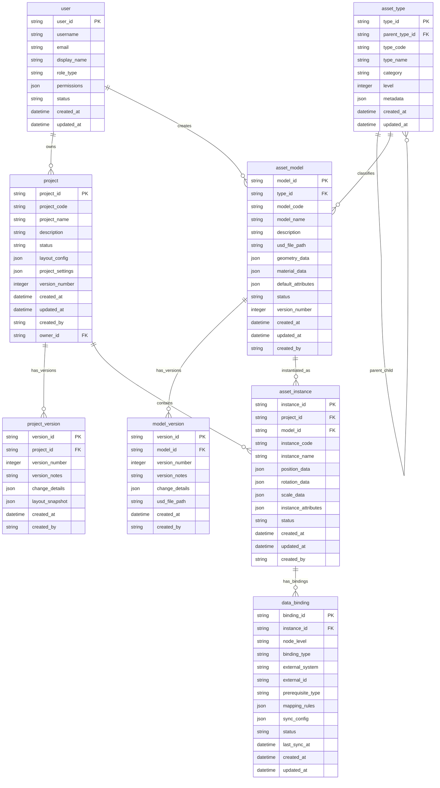

# 附件 A：数据模型与数据字典（Appendix_A_DataModel_DataDictionary.md）

> 本附件承载"可执行的数据定义"。  
> 推荐顺序：对象清单 → ERD → 表清单 → 字段字典 → 枚举字典 → 口径对齐 → 迁移初始化（如有）

## A1. 数据对象清单

### 主数据对象
- **资产类型 (asset_type)**：3D资产的分类体系，支持树级结构
- **资产模型 (asset_model)**：设备或产线的3D数字模型"蓝图"，包含几何、材质和默认属性
- **模型版本 (model_version)**：资产模型的版本历史记录
- **用户 (user)**：系统用户账户和权限信息

### 交易/单据对象
- **工厂项目 (project)**：工厂布局设计的项目单元，包含布局配置和设置
- **项目版本 (project_version)**：工厂项目的版本历史记录
- **资产实例 (asset_instance)**：在具体项目中根据资产模型创建的实例，具有空间位置和实例属性
- **业务数据绑定 (data_binding)**：资产实例与外部业务系统数据的关联关系

### 配置/字典对象
- **系统配置表**：系统运行时配置参数
- **字典表**：业务枚举值、分类标准等
- **模板表**：产线模板、设备组合模板等

### 日志/审计对象
- **操作日志表**：用户操作记录
- **审计日志表**：数据变更审计记录
- **系统日志表**：系统运行和错误日志

## A2. ER 图（ERD）

> 图示：ERD（主表/子表、外键关系、基数、关键索引建议）

## A3. 表清单（Table List）

| 表名 | 类型 | 主键 | 关键索引 | 说明 |
|------|------|------|---------|------|
| asset_type | 主数据 | type_id | idx_parent_type_id, idx_type_code | 资产类型分类表 |
| asset_model | 主数据 | model_id | idx_type_id, idx_model_code, idx_status | 资产模型表 |
| model_version | 日志/版本 | version_id | idx_model_id, idx_version_number | 模型版本历史表 |
| project | 交易/单据 | project_id | idx_project_code, idx_status, idx_owner_id | 工厂项目表 |
| project_version | 日志/版本 | version_id | idx_project_id, idx_version_number | 项目版本历史表 |
| asset_instance | 交易/单据 | instance_id | idx_project_id, idx_model_id, idx_instance_code | 资产实例表 |
| user | 主数据 | user_id | idx_username, idx_email, idx_role_type | 用户表 |
| data_binding | 交易/单据 | binding_id | idx_instance_id, idx_external_system, idx_external_id | 业务数据绑定表 |
| system_config | 配置 | config_id | idx_config_key, idx_module | 系统配置表 |
| dictionary | 配置 | dict_id | idx_dict_type, idx_dict_code | 字典表 |
| operation_log | 日志/审计 | log_id | idx_user_id, idx_operation_type, idx_created_at | 操作日志表 |
| audit_log | 日志/审计 | audit_id | idx_table_name, idx_record_id, idx_operation_time | 审计日志表 |

## A4. 字段清单（字段字典）

### asset_type（资产类型表）

| 表名 | 字段名 | 中文名 | 类型 | 是否必填 | 默认值 | 枚举/字典 | 约束 | 说明 |
|------|--------|-------|------|---------|-------|----------|------|------|
| asset_type | type_id | 类型ID | VARCHAR(36) | 是 | UUID() | - | PK | 类型唯一标识 |
| asset_type | parent_type_id | 父类型ID | VARCHAR(36) | 否 | NULL | - | FK → asset_type.type_id | 支持树结构 |
| asset_type | type_code | 类型编码 | VARCHAR(50) | 是 | - | - | 唯一索引 | 业务唯一编码 |
| asset_type | type_name | 类型名称 | VARCHAR(100) | 是 | - | - | - | 类型显示名称 |
| asset_type | category | 大类分类 | VARCHAR(50) | 是 | - | EQUIPMENT, PRODUCTION_LINE, FACTORY | - | 顶级分类 |
| asset_type | level | 层级深度 | INTEGER | 是 | 0 | - | ≥0 | 树层级，根为0 |
| asset_type | metadata | 元数据 | JSON | 否 | {} | - | - | 扩展元数据 |
| asset_type | created_at | 创建时间 | DATETIME | 是 | CURRENT_TIMESTAMP | - | - | 记录创建时间 |
| asset_type | updated_at | 更新时间 | DATETIME | 是 | CURRENT_TIMESTAMP | - | - | 记录更新时间 |

### asset_model（资产模型表）

| 表名 | 字段名 | 中文名 | 类型 | 是否必填 | 默认值 | 枚举/字典 | 约束 | 说明 |
|------|--------|-------|------|---------|-------|----------|------|------|
| asset_model | model_id | 模型ID | VARCHAR(36) | 是 | UUID() | - | PK | 模型唯一标识 |
| asset_model | type_id | 类型ID | VARCHAR(36) | 是 | - | - | FK → asset_type.type_id | 所属资产类型 |
| asset_model | model_code | 模型编码 | VARCHAR(50) | 是 | - | - | 唯一索引 | 类型内唯一编码 |
| asset_model | model_name | 模型名称 | VARCHAR(100) | 是 | - | - | - | 模型显示名称 |
| asset_model | description | 描述 | TEXT | 否 | NULL | - | - | 详细描述 |
| asset_model | usd_file_path | USD文件路径 | VARCHAR(500) | 是 | - | - | - | USD文件存储路径 |
| asset_model | geometry_data | 几何数据 | JSON | 是 | {} | - | - | 几何数据摘要 |
| asset_model | material_data | 材质数据 | JSON | 是 | {} | - | - | 材质数据 |
| asset_model | default_attributes | 默认属性 | JSON | 是 | {} | - | - | 默认业务属性 |
| asset_model | status | 状态 | VARCHAR(20) | 是 | "DRAFT" | DRAFT, ACTIVE, INACTIVE, ARCHIVED | - | 模型状态 |
| asset_model | version_number | 版本号 | INTEGER | 是 | 1 | - | ≥1 | 当前版本号 |
| asset_model | created_at | 创建时间 | DATETIME | 是 | CURRENT_TIMESTAMP | - | - | 记录创建时间 |
| asset_model | updated_at | 更新时间 | DATETIME | 是 | CURRENT_TIMESTAMP | - | - | 记录更新时间 |
| asset_model | created_by | 创建人 | VARCHAR(36) | 是 | - | - | FK → user.user_id | 创建用户ID |

### model_version（模型版本表）

| 表名 | 字段名 | 中文名 | 类型 | 是否必填 | 默认值 | 枚举/字典 | 约束 | 说明 |
|------|--------|-------|------|---------|-------|----------|------|------|
| model_version | version_id | 版本ID | VARCHAR(36) | 是 | UUID() | - | PK | 版本唯一标识 |
| model_version | model_id | 模型ID | VARCHAR(36) | 是 | - | - | FK → asset_model.model_id | 所属模型 |
| model_version | version_number | 版本号 | INTEGER | 是 | - | - | ≥1 | 版本序号 |
| model_version | version_notes | 版本说明 | TEXT | 否 | NULL | - | - | 版本变更说明 |
| model_version | change_details | 变更详情 | JSON | 是 | {} | - | - | 详细变更内容 |
| model_version | usd_file_path | USD文件路径 | VARCHAR(500) | 是 | - | - | - | 该版本USD文件路径 |
| model_version | created_at | 创建时间 | DATETIME | 是 | CURRENT_TIMESTAMP | - | - | 版本创建时间 |
| model_version | created_by | 创建人 | VARCHAR(36) | 是 | - | - | FK → user.user_id | 创建用户ID |

### project（工厂项目表）

| 表名 | 字段名 | 中文名 | 类型 | 是否必填 | 默认值 | 枚举/字典 | 约束 | 说明 |
|------|--------|-------|------|---------|-------|----------|------|------|
| project | project_id | 项目ID | VARCHAR(36) | 是 | UUID() | - | PK | 项目唯一标识 |
| project | project_code | 项目编码 | VARCHAR(50) | 是 | - | - | 唯一索引 | 组织内唯一编码 |
| project | project_name | 项目名称 | VARCHAR(100) | 是 | - | - | - | 项目显示名称 |
| project | description | 描述 | TEXT | 否 | NULL | - | - | 项目详细描述 |
| project | status | 状态 | VARCHAR(20) | 是 | "DRAFT" | DRAFT, COMPLETED, PUBLISHED, ARCHIVED | - | 项目状态 |
| project | layout_config | 布局配置 | JSON | 是 | {} | - | - | 布局尺寸、坐标系等 |
| project | project_settings | 项目设置 | JSON | 是 | {} | - | - | 权限、集成配置等 |
| project | version_number | 版本号 | INTEGER | 是 | 1 | - | ≥1 | 当前版本号 |
| project | created_at | 创建时间 | DATETIME | 是 | CURRENT_TIMESTAMP | - | - | 项目创建时间 |
| project | updated_at | 更新时间 | DATETIME | 是 | CURRENT_TIMESTAMP | - | - | 项目更新时间 |
| project | created_by | 创建人 | VARCHAR(36) | 是 | - | - | FK → user.user_id | 创建用户ID |
| project | owner_id | 负责人 | VARCHAR(36) | 是 | - | - | FK → user.user_id | 项目负责人ID |

### project_version（项目版本表）

| 表名 | 字段名 | 中文名 | 类型 | 是否必填 | 默认值 | 枚举/字典 | 约束 | 说明 |
|------|--------|-------|------|---------|-------|----------|------|------|
| project_version | version_id | 版本ID | VARCHAR(36) | 是 | UUID() | - | PK | 版本唯一标识 |
| project_version | project_id | 项目ID | VARCHAR(36) | 是 | - | - | FK → project.project_id | 所属项目 |
| project_version | version_number | 版本号 | INTEGER | 是 | - | - | ≥1 | 版本序号 |
| project_version | version_notes | 版本说明 | TEXT | 是 | - | - | - | 版本变更说明 |
| project_version | change_details | 变更详情 | JSON | 是 | {} | - | - | 详细变更内容 |
| project_version | layout_snapshot | 布局快照 | JSON | 是 | {} | - | - | 完整布局状态快照 |
| project_version | created_at | 创建时间 | DATETIME | 是 | CURRENT_TIMESTAMP | - | - | 版本创建时间 |
| project_version | created_by | 创建人 | VARCHAR(36) | 是 | - | - | FK → user.user_id | 创建用户ID |

### asset_instance（资产实例表）

| 表名 | 字段名 | 中文名 | 类型 | 是否必填 | 默认值 | 枚举/字典 | 约束 | 说明 |
|------|--------|-------|------|---------|-------|----------|------|------|
| asset_instance | instance_id | 实例ID | VARCHAR(36) | 是 | UUID() | - | PK | 实例唯一标识 |
| asset_instance | project_id | 项目ID | VARCHAR(36) | 是 | - | - | FK → project.project_id | 所属项目 |
| asset_instance | model_id | 模型ID | VARCHAR(36) | 是 | - | - | FK → asset_model.model_id | 源模型 |
| asset_instance | instance_code | 实例编码 | VARCHAR(50) | 是 | - | - | 唯一索引（项目内） | 项目内唯一编码 |
| asset_instance | instance_name | 实例名称 | VARCHAR(100) | 是 | - | - | - | 实例显示名称 |
| asset_instance | position_data | 位置数据 | JSON | 是 | {} | - | - | 空间坐标(x,y,z) |
| asset_instance | rotation_data | 旋转数据 | JSON | 是 | {} | - | - | 旋转角度(x,y,z,w) |
| asset_instance | scale_data | 缩放数据 | JSON | 是 | {} | - | - | 缩放比例(x,y,z) |
| asset_instance | instance_attributes | 实例属性 | JSON | 是 | {} | - | - | 实例特有业务属性 |
| asset_instance | status | 状态 | VARCHAR(20) | 是 | "ACTIVE" | ACTIVE, INACTIVE, MAINTENANCE | - | 实例使用状态 |
| asset_instance | created_at | 创建时间 | DATETIME | 是 | CURRENT_TIMESTAMP | - | - | 实例创建时间 |
| asset_instance | updated_at | 更新时间 | DATETIME | 是 | CURRENT_TIMESTAMP | - | - | 实例更新时间 |
| asset_instance | created_by | 创建人 | VARCHAR(36) | 是 | - | - | FK → user.user_id | 创建用户ID |

### user（用户表）

| 表名 | 字段名 | 中文名 | 类型 | 是否必填 | 默认值 | 枚举/字典 | 约束 | 说明 |
|------|--------|-------|------|---------|-------|----------|------|------|
| user | user_id | 用户ID | VARCHAR(36) | 是 | UUID() | - | PK | 用户唯一标识 |
| user | username | 用户名 | VARCHAR(50) | 是 | - | - | 唯一索引 | 系统登录用户名 |
| user | email | 邮箱 | VARCHAR(100) | 是 | - | - | 唯一索引 | 用户邮箱地址 |
| user | display_name | 显示名称 | VARCHAR(100) | 是 | - | - | - | 用户显示名称 |
| user | role_type | 角色类型 | VARCHAR(50) | 是 | - | IE_ENGINEER, U3D_ENGINEER, FACTORY_PLANNER, ADMIN | - | 用户角色 |
| user | permissions | 权限配置 | JSON | 是 | {} | - | - | 扩展权限配置 |
| user | status | 状态 | VARCHAR(20) | 是 | "ACTIVE" | ACTIVE, INACTIVE, SUSPENDED | - | 用户状态 |
| user | created_at | 创建时间 | DATETIME | 是 | CURRENT_TIMESTAMP | - | - | 用户创建时间 |
| user | updated_at | 更新时间 | DATETIME | 是 | CURRENT_TIMESTAMP | - | - | 用户更新时间 |

### data_binding（业务数据绑定表）

| 表名 | 字段名 | 中文名 | 类型 | 是否必填 | 默认值 | 枚举/字典 | 约束 | 说明 |
|------|--------|-------|------|---------|-------|----------|------|------|
| data_binding | binding_id | 绑定ID | VARCHAR(36) | 是 | UUID() | - | PK | 绑定唯一标识 |
| data_binding | instance_id | 实例ID | VARCHAR(36) | 是 | - | - | FK → asset_instance.instance_id | 绑定的资产实例 |
| data_binding | node_level | 节点层级 | VARCHAR(20) | 是 | - | FACTORY, LINE, EQUIPMENT | - | 该绑定所属节点层级（制程不参与绑定） |
| data_binding | binding_type | 绑定类型 | VARCHAR(20) | 是 | - | BASIC_DATA, LEDGER, IOT, EVENTS, MONITOR, METRICS | UNIQUE(instance_id, binding_type) | 绑定数据类型；同一实例的同一类型只能有一条绑定记录 |
| data_binding | external_system | 外部系统 | VARCHAR(50) | 否 | NULL | ERP, MES, WMS, IOT | - | 数据来源的外部系统类型（经基础数据平台中转） |
| data_binding | external_id | 外部ID | VARCHAR(100) | 否 | NULL | - | - | 外部系统中的标识（编码等） |
| data_binding | prerequisite_type | 前置绑定类型 | VARCHAR(20) | 否 | NULL | BASIC_DATA, LEDGER | - | 完成本绑定类型前必须先完成的绑定类型；NULL表示无前置 |
| data_binding | mapping_rules | 映射规则 | JSON | 是 | {} | - | - | 字段映射规则 |
| data_binding | sync_config | 同步配置 | JSON | 是 | {} | - | - | 同步频率、方式等配置 |
| data_binding | status | 状态 | VARCHAR(20) | 是 | "UNCONFIGURED" | UNCONFIGURED, CONFIGURING, ACTIVE, ERROR, DISABLED | - | 绑定类型当前状态（详见 PRD_Main 3.5.3） |
| data_binding | last_sync_at | 最后同步时间 | DATETIME | 否 | NULL | - | - | 最近成功同步时间 |
| data_binding | created_at | 创建时间 | DATETIME | 是 | CURRENT_TIMESTAMP | - | - | 绑定创建时间 |
| data_binding | updated_at | 更新时间 | DATETIME | 是 | CURRENT_TIMESTAMP | - | - | 绑定更新时间 |

## A5. 枚举与字典清单

### 资产类型分类（asset_type.category）

| 字典项 | 值 | 文案 | 说明 | 是否可配置 | 生效范围 |
|--------|----|------|------|-----------|---------|
| 设备 | EQUIPMENT | 设备 | 单个设备，如CNC机床、机器人等 | 否 | 全局 |
| 产线 | PRODUCTION_LINE | 产线 | 生产线，由多个设备组成 | 否 | 全局 |
| 工厂结构 | FACTORY | 工厂结构 | 厂房、车间、仓库等建筑结构 | 否 | 全局 |

### 资产模型状态（asset_model.status）

| 字典项 | 值 | 文案 | 说明 | 是否可配置 | 生效范围 |
|--------|----|------|------|-----------|---------|
| 草稿 | DRAFT | 草稿 | 模型创建中，未完成 | 否 | 模型管理 |
| 激活 | ACTIVE | 激活 | 模型可用，可被项目引用 | 否 | 模型管理 |
| 停用 | INACTIVE | 停用 | 模型暂时不可用 | 否 | 模型管理 |
| 归档 | ARCHIVED | 归档 | 模型已归档，只读 | 否 | 模型管理 |

### 项目状态（project.status）

| 字典项 | 值 | 文案 | 说明 | 是否可配置 | 生效范围 |
|--------|----|------|------|-----------|---------|
| 草稿 | DRAFT | 草稿 | 项目创建中 | 否 | 项目管理 |
| 设计中 | IN_PROGRESS | 设计中 | 项目正在编辑 | 否 | 项目管理 |
| 评审中 | REVIEW | 评审中 | 项目等待评审 | 否 | 项目管理 |
| 已发布 | PUBLISHED | 已发布 | 项目已定稿 | 否 | 项目管理 |
| 已归档 | ARCHIVED | 已归档 | 项目已归档 | 否 | 项目管理 |

### 资产实例状态（asset_instance.status）

| 字典项 | 值 | 文案 | 说明 | 是否可配置 | 生效范围 |
|--------|----|------|------|-----------|---------|
| 激活 | ACTIVE | 激活 | 实例正常使用 | 否 | 实例管理 |
| 停用 | INACTIVE | 停用 | 实例暂时不用 | 否 | 实例管理 |
| 维护中 | MAINTENANCE | 维护中 | 实例正在维护 | 否 | 实例管理 |

### 用户角色（user.role_type）

| 字典项 | 值 | 文案 | 说明 | 是否可配置 | 生效范围 |
|--------|----|------|------|-----------|---------|
| IE工程师 | IE_ENGINEER | IE工程师 | 工业工程师，主要用户 | 是 | 用户管理 |
| 3D模型工程师 | U3D_ENGINEER | 3D模型工程师 | 负责3D模型创建和维护 | 是 | 用户管理 |
| 工厂规划师 | FACTORY_PLANNER | 工厂规划师 | 工厂布局规划专家 | 是 | 用户管理 |
| 系统管理员 | ADMIN | 系统管理员 | 系统管理和配置 | 是 | 用户管理 |

### 外部系统类型（data_binding.external_system）

| 字典项 | 值 | 文案 | 说明 | 是否可配置 | 生效范围 |
|--------|----|------|------|-----------|---------|
| ERP系统 | ERP | ERP系统 | 企业资源计划系统 | 是 | 数据绑定 |
| MES系统 | MES | MES系统 | 制造执行系统 | 是 | 数据绑定 |
| WMS系统 | WMS | WMS系统 | 仓库管理系统 | 是 | 数据绑定 |
| IoT平台 | IOT | IoT平台 | 物联网平台 | 是 | 数据绑定 |

### 绑定类型（data_binding.binding_type）

> 各节点层级可用的绑定类型详见 PRD_Main 3.5.1 绑定类型矩阵。工厂/产线使用 BASIC_DATA 作为基础绑定；设备使用 LEDGER（台账）作为其基础数据绑定，台账本身即包含设备的编码、名称、规格等主数据标识。

| 字典项 | 值 | 文案 | 说明 | 适用节点层级 | 是否必需 | 状态机类型 | 前置类型 |
|--------|----|------|------|------------|---------|----------|---------|
| 基础数据 | BASIC_DATA | 基础数据 | 工厂/产线的基础主数据绑定（编码、名称、所属组织等）；绑定后其他可选类型才可配置 | 工厂、产线 | 必需 | 表单型 | 无 |
| 台账 | LEDGER | 台账 | 设备的基础数据绑定，包含编码、名称、规格参数、工艺参数、维护记录等全量主数据；完成后 IoT 自动进入部分配置 | 设备 | 必需 | 表单型 | 无 |
| IoT | IOT | IoT配置 | IoT 采集点位绑定（协议、点位、采集周期等）；台账完成后自动从台账数据填充点位，进入「部分配置」状态 | 设备 | 可选 | 表单型 | LEDGER |
| 事件 | EVENTS | 事件配置 | 事件规则绑定（触发条件、告警级别等），逐条配置 | 产线、设备 | 可选 | 规则型 | BASIC_DATA（产线）/ LEDGER（设备） |
| 状态监控 | MONITOR | 状态监控 | 监控参数与阈值绑定，逐条配置 | 产线、设备 | 可选 | 规则型 | BASIC_DATA（产线）/ LEDGER（设备） |
| KPI指标 | METRICS | KPI指标 | KPI公式与指标绑定（OEE、MTBF等），逐条配置 | 工厂、产线、设备 | 可选 | 规则型 | BASIC_DATA（工厂/产线）/ LEDGER（设备） |

### 绑定状态（data_binding.status）

按绑定类型的「状态机类型」分为两套状态值：

**表单型状态**（BASIC_DATA / LEDGER / IOT）：

| 字典项 | 值 | 文案 | 说明 | 是否可配置 |
|--------|----|------|------|-----------|
| 未配置 | UNCONFIGURED | 未配置 | 初始状态，无任何数据保存；前置未完成时锁定 | 否 |
| 部分配置 | PARTIAL | 部分配置 | 已保存部分数据，必填字段不完整；IoT 台账完成后自动进入此状态 | 否 |
| 已绑定 | ACTIVE | 已绑定 | 所有必填字段完整，校验通过，同步正常 | 否 |
| 绑定异常 | ERROR | 绑定异常 | 已绑定后出现异常（数据源不可达/记录变更等） | 否 |
| 已禁用 | DISABLED | 已禁用 | 用户手动禁用，暂停同步 | 否 |

**规则型状态**（EVENTS / MONITOR / METRICS）：

| 字典项 | 值 | 文案 | 说明 | 是否可配置 |
|--------|----|------|------|-----------|
| 未配置 | UNCONFIGURED | 未配置 | 无任何规则/公式，或全部删除后 | 否 |
| 已配置 | CONFIGURED | 已配置 | 至少有一条规则/公式已保存生效 | 否 |
| 绑定异常 | ERROR | 绑定异常 | 规则引用的字段/点位不可用（异步检测） | 否 |
| 已禁用 | DISABLED | 已禁用 | 用户手动禁用，规则暂停生效 | 否 |

### 节点层级（data_binding.node_level）

| 字典项 | 值 | 文案 | 说明 | 是否可配置 | 生效范围 |
|--------|----|------|------|-----------|---------|
| 工厂 | FACTORY | 工厂 | 工厂层级节点 | 否 | 数据绑定 |
| 产线 | LINE | 产线 | 产线层级节点 | 否 | 数据绑定 |
| 设备 | EQUIPMENT | 设备 | 设备层级节点 | 否 | 数据绑定 |

## A6. 数据口径与对账

### 关键口径（库存/金额/数量/状态）主口径系统

| 数据项 | 主口径系统 | 更新频率 | 负责人 | 备注 |
|--------|-----------|---------|--------|------|
| 设备主数据 | ERP系统 | 每日同步 | 设备管理部门 | 设备型号、规格、技术参数 |
| 设备实时状态 | MES系统 | 实时同步（≤5秒） | 生产车间 | 运行状态、故障信息、产量 |
| 物料库存 | WMS系统 | 每小时同步 | 仓库管理部门 | 物料数量、库位信息 |
| 生产订单 | ERP系统 | 每日同步 | 生产计划部门 | 订单号、产品、数量、交期 |
| 设备维护记录 | MES系统 | 每日同步 | 设备维护部门 | 维护计划、历史记录 |

### 对账周期与对象

| 对账对象 | 对账周期 | 对账时间 | 对账方式 | 容差范围 |
|----------|---------|---------|---------|---------|
| 设备数量 | 每日 | 02:00 AM | 系统自动对账 | ≤0.1% |
| 设备状态一致性 | 每小时 | 整点 | 系统自动对账 | 状态同步延迟≤5分钟 |
| 物料库存 | 每日 | 03:00 AM | 系统自动对账 | ≤1% |
| 布局完整性 | 每周 | 周一 09:00 AM | 人工抽检 | 关键设备100%准确 |
| 数据绑定完整率 | 每日 | 04:00 AM | 系统自动检查 | ≥99.5% |

### 差异处理流程与阈值

1. **差异检测**：系统自动检测数据不一致性
2. **差异分级**：
   - **一级差异（紧急）**：关键设备状态不一致、安全相关数据错误
   - **二级差异（重要）**：设备数量不一致、重要属性缺失
   - **三级差异（一般）**：非关键属性不一致、历史数据不同步
3. **处理流程**：
   - 一级差异：立即告警，30分钟内人工介入处理
   - 二级差异：4小时内处理，系统自动重试同步
   - 三级差异：24小时内处理，定期批量修复
4. **阈值设置**：
   - 设备状态同步延迟阈值：5分钟
   - 数据绑定准确率阈值：99%
   - 自动修复重试次数：3次
   - 人工干预触发条件：自动修复失败或差异超过容差

## A7. 数据迁移与初始化（如适用）

### 存量范围

1. **设备3D模型**：现有设备3D模型（USD格式）
2. **产线布局图**：现有工厂3D布局图（USD等格式）
3. **设备主数据**：ERP系统中的设备台账（约5000条记录）
4. **物料主数据**：ERP系统中的物料主数据（约10000条记录）
5. **用户数据**：现有系统用户账户（约200个用户）

### 初始化策略

1. **分批迁移**：
   - 第一期：核心生产设备（约500个关键设备）
   - 第二期：辅助设备及产线模板（约2000个设备）
   - 第三期：历史布局方案及物料数据
2. **数据转换**：
   - 2D布局图 → 3D场景：半自动转换，人工校验
   - 业务数据映射：基于映射规则自动转换，人工审核
3. **质量校验**：
   - 模型完整性检查：几何、材质、纹理完整性
   - 数据一致性检查：与源系统数据一致性对比
   - 性能验证：迁移后场景渲染性能测试

### 校验与回滚

1. **校验机制**：
   - **预迁移校验**：迁移前数据质量评估
   - **迁移中校验**：每批迁移后立即校验
   - **迁移后校验**：全量迁移完成后综合校验
2. **回滚策略**：
   - **数据回滚**：迁移失败时恢复到迁移前状态
   - **版本回滚**：问题数据可回退到前一版本
   - **增量回滚**：仅回滚问题批次，保留成功批次
3. **验收标准**：
   - 模型转换成功率≥95%
   - 数据映射准确率≥99%
   - 系统性能达标率100%
   - 用户验收通过率≥90%

---

**附件A结束**